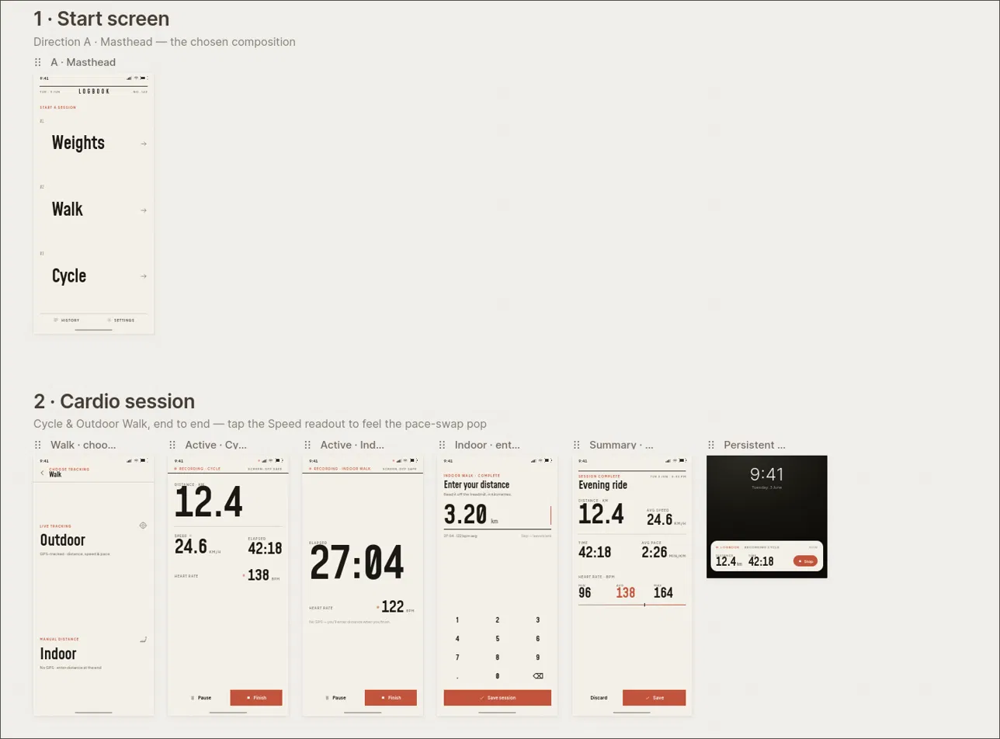

## A native Android, offline-first app with no signups, no cloud and no nonsense.

I built an app for myself. not for a client, not with the end goal of it being a money making side hustle, just an app for myself that did exactly what I wanted it to do.

### The Problem.

I've been trying to get more active in the past couple of years, and I've found that there are 3 main exercise types that work for me: bike rides, walks and the gym. Me being the tech nerd that I am, I have dabbled in the exercise tracking space and have used my fair share of apps. I used to have an Apple Watch, so that just did most of my tracking. I also had FitBod (shoutout to the Connected podcast) for the gym. When I switched _back_ to Android, I got the Xiaomi Mi Band 8. I wasn't a fan of the app, but at least it tracked all the data I needed. Then I stopped using the band, because I'm a watch guy and I wasn't going to wear 2 things on my wrist. My setup finally ended up being RepCount to track gym stuff, and Google Fit for my bike rides and walks. Recently the Fitbit Air came out, and it got me wondering if I would be ok wearing a screenless tracker on the other wrist. I liked the idea of tracking heart rate again, and as I did my research, I learned that chest straps are actually cheaper and much more accurate than wrist based sensors. The cherry on top of it was that they worked on open bluetooth protocols. The gears started turning.

With the advent of AI and LLM technology today, the barrier to getting started on something like this is significantly lower than it was even 3 years ago. I knew exactly what I wanted, and while I didn't know _exactly how to build it_, I had a rough idea, and that's all I needed.

A few conversations with Opus 4.8 in, I hit my first roadblock. You see, while I have built mobile apps before, my domain has always been the web. Even in the mobile world, I've dabbled with Flutter and React Native, but never fully native. The API I needed for the chest strap however, didn't have a React Native workaround, which means for the first time in my life, I had to go Android-native.

At any point in the past, this is where I would've walked away. While I am a developer and I understand enough to pick up new languages, the intricacies and domain knowledge needed to build a **good native app on Android are daunting. Trust me, I've used Android since version 2.1, good apps are much harder to find compared to iOS. However, my brain being the SWOT-conditioned thing it is, decided to look at this as an opportunity.**

### The Constraints.

This would effectively be the first project _(for myself)_ that I would be working on and effectively writing 0 code, so I had to make sure the rules and guidelines were locked down for the entire project. Having run a web-development agency for the past 3 years, I've gotten pretty good at dictating exactly how things need to be done, and designing workflows to make sure the work being done is optimal.

On the workflow side, these were the constraints I had

1.  Never jump directly into a task. Ideate with the expensive models. Once you have the full picture of how it needs to be built, have the model check the exact API's needed, double check the suggested implementation, build test cases and then write a fully fledged prompt that the cheaper model executes.
2.  No external research. This one was more of a personal challenge. I'm a skeptic by nature, so even if Claude or Gemini tells me something exists, I ask for sources and double check their work. However, this is not a work project, so the stakes are lower and I was free to experiment. I wanted to see exactly how hands-off I could go and still get something usable. This meant that I only made decisions, asked questions, and told the LLMs what I wanted. All the leg work had to be done by the machines, for science.

On the technical side, I had some constraints as well, but these are just more concise versions of the rules I have for all things I work on _(no clutter, no junk, nothing unnecessary, as lean as possible etc)_.

1.  **Offline-first, always.** Data lives on the device. No mandatory network connection during workouts.
2.  **Sync only on completion.** The whole session gets pushed to a self-hosted server on my home network when the workout ends. No live pushing, no live syncing, no complexity.
3.  **No Android Studio.** Full CLI build on Linux using JDK, Android SDK command-line tools, and Gradle. assembleDebug, adb install, done.
4.  **Single user.** No accounts, no auth flows, no multi-tenancy to design around.
5.  **Android-native Kotlin only.** No cross-platform framework, no React Native, no Expo. The constraint that ruled out React Native became the reason to go fully native.

### The Decisions That Mattered.

**Going native simplified the stack, it didn't complicate it.** The usual argument for React Native is cross-platform. I didn't need cross-platform, I needed Android and I needed BLE as a first-class feature, not a workaround. Once I made the call to go native, Room for local storage, the Android BLE APIs, and foreground services all became straightforward choices instead of problems to solve around.

**One endpoint, one atomic call.** The entire sync layer is a single PUT /sessions/{id} that carries the full session graph: exercises, sets, heart rate aggregates, everything. One call when the workout ends. Idempotent, simple, and exactly what "sync when done" actually wants architecturally. No partial syncs, no conflict resolution hell.

**Client-generated UUIDs.** Records get their IDs on the device before they've ever touched the server. That meant offline records had stable identity, and the server never needed to reconcile anything. It also made the sync logic straightforward: the server just upserts whatever it receives.

### How It Was Built.

The process was split across two largely separate codebases held in alignment by a shared API contract. The contract: one small document duplicated verbatim into both technical briefs. This served as the single source of truth. Any time something changed, it changed there first.

Claude helped kick off the project; for initial research (what does Android development actually look like in 2026?), for generating the technical briefs that structured the builds, and for the design phase where I used Claude's design tooling to produce HTML mockups as a brief for the UI. The aesthetic brief was editorial, tabular figures so live numbers don't jitter, big glanceable type for active sessions, Mohave for display, Plus Jakarta Sans for the rest. I had to go homegrown for fonts, shoutout to [Tokotype](https://www.tokotype.com/).

Two separate agent sessions handled the build: one for the Kotlin Android app, one for the Hono/TypeScript API. Each worked from their own brief, but both referenced the same shared contract. A test script verified the backend before the phone ever came into the picture.

I also want to be honest that this wasn't "describe it and it appeared." I was constantly doing the translation layer work, describing what I wanted in web development terms and figuring out what the Android equivalent was. Knowing what good output looked like, knowing when to push back, and finding the bugs through actual daily use. None of that was automated.

### The Stack.

-   **Android app:** Kotlin, Room/SQLite, Android BLE APIs, foreground service for live tracking
-   **API:** Hono (TypeScript), SQLite
-   **Dashboard:** Solid + Tailwind + Vite, served as static assets by the same Hono process

### The Result.

Built in under a weekend. Been using it every day since.

**Gym sessions:** Start a session, add exercises by name (pulls from history), log sets as weight × reps. Active session view shows current exercise, set log, elapsed time, and live heart rate from the chest strap. Rest timer lives in a bottom bar that pulls up into a card.

**Cardio:** Outdoor (GPS) and indoor (manual distance entry) walk modes. Live view shows time, distance, pace that swaps to speed on tap, and heart rate. I also added steps 3 days in, I thought I wouldn't need it, but turns out its nice to have sometimes. Bike rides work the same way.

**Heart rate:** Pulled live from a Bluetooth chest strap. Min, max, and average stored per session. No time series, just the aggregates, aka all I cared about.

**Sync:** Optional. When I'm home and the session ends, it syncs to a server running on my home network. The web dashboard shows an activity log of everything across all session types.

No accounts. No cloud. No nonsense.
