_**Notice:** this article is going to be quite lengthy, as it is basically a summary of an entire year’s worth of work._

Let’s be honest, the public transport system in Melbourne isn’t the best. Don’t get me wrong, its great that it works _(occasionally),_ especially for someone like me, who coming from a country like Indonesia has little to no inclination on how public transport systems should work. However, there are a lot of things that could be changed, and one of them is the way they handle their mobile apps.

## The Backstory.

Firstly, let me preface this article by giving you a little back story into why we chose this to tackle this whole “public transport” issue. In the simplest of terms, it was assigned to us. We started this project a little under a year ago, as part of our 3rd year IT project. There were 8 possible projects on the board for us to choose _(and by choose I mean vote on the one we want and see if they’ll actually give it to us)._ It just so happens that this was the one that stood out to us. The client, ICT at Latrobe, was never very specific on what the requirements were to be, instead they were generous enough to give us free creative control on what the product should look like and what aspects it should tackle. So essentially, we had two things to consider when starting;

1.  _To create something that encompasses all the public transport services around La Trobe University’s 5 campuses_
2.  _There would be a kiosk of unknown dimensions, which means it has to be responsive (and seeing as it’s 2016, that’s pretty much a given anyway)._

## The Existing Services.

Public transport apps are a dime a dozen. This was both a good thing and a bad thing for us. A good thing because there was already all this research that people had done, all these apps had proven themselves and had essentially created a set of “standard operating procedures” for public transport apps. Bad, because, well all these apps were out there, which meant that to stand out, we’d have to do something they weren’t, in a way they weren’t.

Without a doubt, the most used public transport app in Victoria at the moment, is the official PTV (Public Transport of Victoria) application. There’s one problem with the app, it’s not very pleasing to use. It’s overloaded with features, most of who’s functions aren’t easily discernible. In addition to that it’s flow is somewhat tedious and annoying. So much so that most people we spoke to over our time developing this app claimed that they had just given up on the app and switched to just reading the timetables on the bus stops and trying to remember them. The messy and clunky flow that I speak of extends to their website, which is good if you want detailed information, but not that good if you just want to jump on and check what time your next bus or train is, as most university students want to.

## Research.

So we sort of had the idea that people didn’t like the current PTV app, but that really wasn’t enough to go on. There were 2 other teams working on the same problem as us, so not only did we have to come up with a good solution, we had to come up with one that was better than our competition.

The simple presence of competition in this whole situation had unnerved some of our teammates. There was a sense of urgency, and a lot of push from outside parties to “just start building”. However, we knew that in order to stand out, there was a lot more we needed to know about our problem before we could just build it. So before we could design the best solution, there was something else we needed to design, a questionnaire.

9 hours and a lot of red-bull later, we had our solution. The perfect questionnaire, 8 questions long, but the right 8 questions, that would have encompassed everything we needed to know about what our fellow students wanted from a public transport app, what they didn’t want and what they might have liked. Writing a questionnaire was only the first part though, because what good is a questionnaire if we don’t have people to answer it.

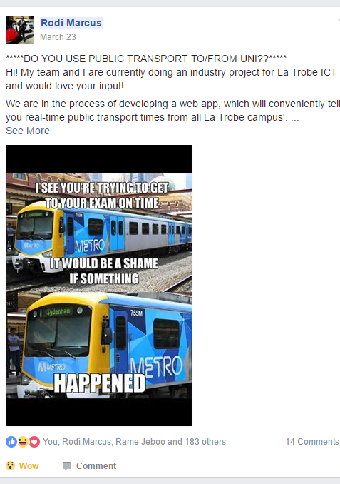

We’re a bit lucky in that case, because we’re a generation that lives on the internet. In addition to that, we had **Stalkerspace.** Stalkerspace (or SS for short) is a facebook group with over 18,000 La Trobe University members. People post on SS daily, and for most of us, it’s our source on what’s happening at the University. We had to be careful though, because as good as a resource SS can be, you really have to stand out to have your post noticed. That’s when one of the boys had the idea to post our questionnaire along with a meme, because people love memes. It worked. Within an hour we had over 150 responses _(we later found out that the competing teams had answers from around 20 people)_ and the number was only climbing.

## More Research.

Answers from the questionnaire were pretty one sided. The one feature people wanted more than anything, was to see the schedules for all the services. Essentially, “how many minutes till my next service”. A problem so simple, yet one that no other public transport app had managed to solve.

The top results read “Bus, Train and Tram Schedules”

However, although we good a pretty good response from the questionnaire _(around 320 responses in total)_, it really didn’t paint the whole picture. We had only asked the students that were on stalkerspace at the time. What about the students that don’t know about stalkerspace, or better yet, the students that don’t go to La Trobe yet? For our next round of research, I set out 3 core segments to target, to supplement the answers we got from current La Trobe University students.

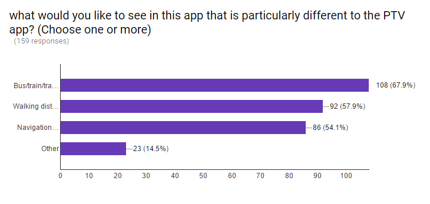

1.  **Parade College Students**: Parade is a high school / junior college a mere 8 minutes away from La Trobe, and a lot of Parade students end up going to La Trobe. In fact, a lot of my close friends graduated from Parade, so I spoke to them and asked them to set up a meeting with some of their juniors who had plans of attending Latrobe when they graduated.
2.  **Students who live on campus:** In our first stage, we forgot something very crucial. Not all students who used Public Transport @ La Trobe used it for the same purpose. Take students who live on campus _(or college students as they’re more commonly known)_, they don’t need to get to university because they’re already here, so what would they use a public transport app for?
3.  **International Students:** Moving to a new country is hard, especially when you don’t understand the public transport system and how it works. International students make up a large percentage of La Trobe.

We created three separate questionnaires for these three different groups, each with questions tailored specifically to that subset of users and the questions we needed to know from them. After our second round of testing, it was finally time to test out a few designs.

## Prototypes on Prototypes on Prototypes.

2 months into our project, all we had was research. Keep in mind there were two other teams working on this project too. These teams had finished their first round of design mock-ups and all we had was numbers. Where some of our peers saw this as disadvantage, we didn’t. We knew exactly what our users wanted us to build, we weren’t just designing for the sake of designing and throwing things at the wall hoping they’d stick.

Based on the user research we did, I had a pretty clear image of what our users wanted and I started playing around in Sketch, trying to visualize what it is the numbers told us. I spent a couple of hours reading through the lackluster and detail-lacking La Trobe University style guide, and what came out of it was one mobile-layout and one kiosk/desktop layout, aka these;

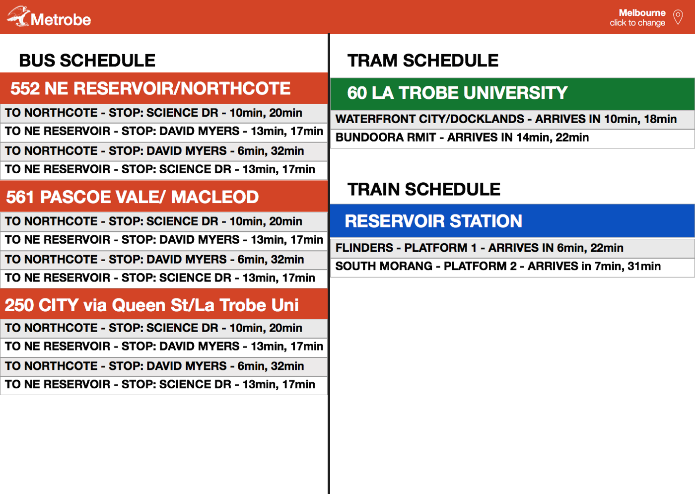

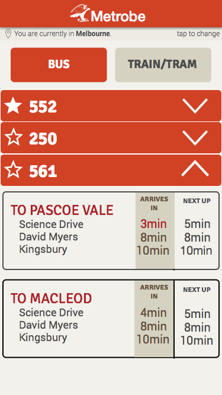

Keep in mind, these were rough mockups, something to show our prospective users to see if we were going in the right direction. Rather than cleaning up the designs, pixel-fitting, adjusting spacing _(as much as my OCD wanted me to)_, we decided to go ahead and test this design with a select few of the responders from our SS survey, as well as a subset of the groups from the other three segments we discussed earlier.

We got feedback, cleaned things up, played around with some colours, and this is what we landed on for **stage 2;**

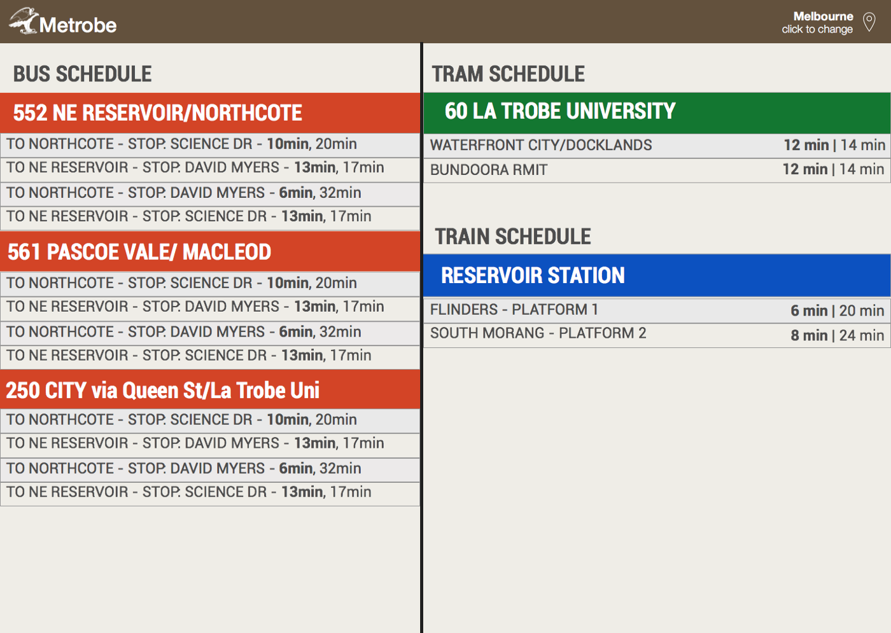

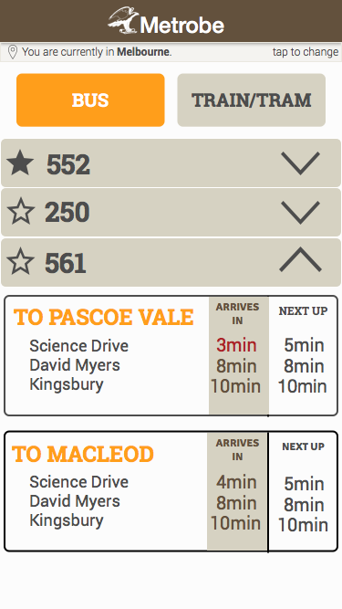

At this point, we were pretty pleased with the design we had come up with. Feedback was surprisingly positive, and we had so much interest from our peers in our app, we actually had people asking us when they would be able to download this. Keep in mind, all this while we hadn’t even started coding it, this was all just mock-ups. We were nearing the end of the first semester and we didn’t even have a functional prototype yet, a fact our supervisors were constantly reminding us about.

# The Second Semester.

The second semester had started, and at this point, the only working code we had was a form that let you fill in the details of the bus/tram/train that you wanted, took the JSON data from PTV’s API, and stored it in an array. At the time of building this, all we thought we would use it for is to test out the PTV API and as proof to our supervisors, to show them that we were in fact actually doing work. However, as the project progressed, this tool that we nicknamed “styled”, became one of the most invaluable assets in our possession. The PTV api was constantly changing, be it route numbers or direction ID’s, it was this tool that let us debug and fix our code within minutes.

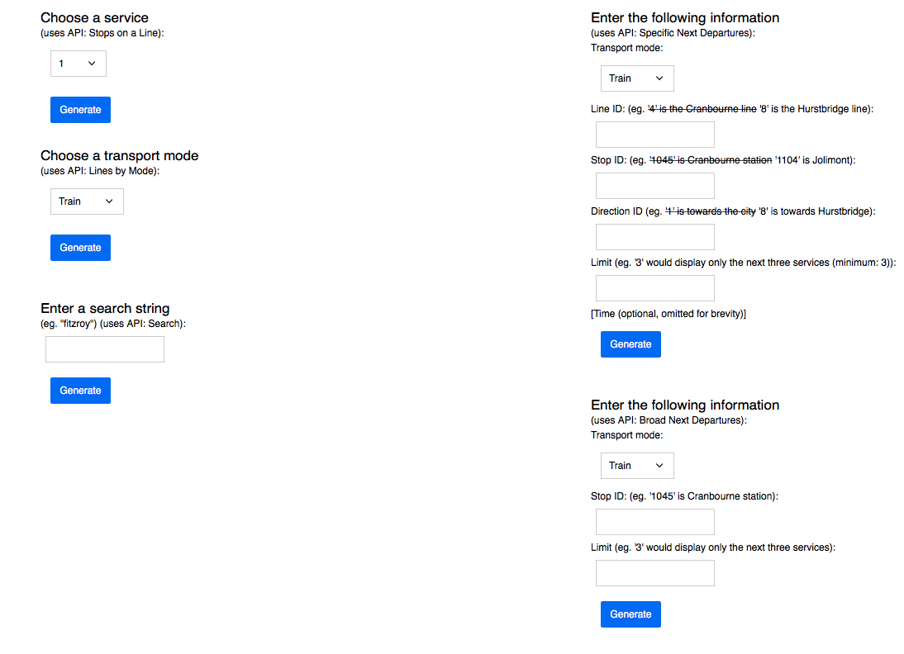

Time was going faster than we had expected. It was week 2, and we had to have our solution by week 5. It was time to start building.

Throughout our whole process with Metrobe, we were encouraged to embrace an “Agile Development Workflow”. We all sort of understood what that meant, but no one could really describe it. We also had to use confluence and JIRA and the suite of Atlassian tools, and a huge focus of all our work had to be based on “User Stories”. This is basically a fancy way of saying break everything your app does into one liners that describes a piece of functionality that a user would require. In building Metrobe, one that stood out to me was;

#### “As a user, I want to be able to load the app quickly on my phone”.

This was also around the time that I had been really into the Progressive Web App movement, and the idea of packaging this as a web app rather than a standalone app. The battle for home screen space is a tough one to fight, and it’s really hard to convince anyone, even ourselves, why you should download an app rather than just open up a bookmark. I’d also been really into the work of people like Brent Jackson, Adam Morse and Jon Gold, who believe that the web should be functional, accessible and light.

It’s because of this that we knew our CSS had to be as light as possible. I’d been really into Atomic CSS, and I opted to build our CSS on top Buzzfeed’s Solid framework, because it was the one I was most comfortable with, and it meant that we had ready access to well written documentation, which means that anyone in the team could pick it up with relative ease, and if we had to pass it on to the university later on, they too would have access to good documentation. So I took all the stuff we would have needed from Solid, stripped out the features we didn’t need _(keeping in mind we would be building an admin interface as well, that allowed admins to log in and delete or add services as they required, essentially meaning that no code would have to be written to update and maintain the website)_ and added in some classes for colours and fonts based on the La Trobe style-guide, and it was good to go. Due to the beauty of Atomic CSS and it’s lightweight nature, our CSS managed to come up to ~30kb minified and gzipped. This may seem like a small number to you, but it’s still pretty big, but this was the best we could do in the timeframe we had.

There are a lot of factors that drove us to making our CSS light, but a simple way to put it is that we’re building for millennials, people like us, who are impatient and can’t deal with load times. Also, by making the resources that we send down to the users phone as small as possible, less of the users data is used, which is something a lot of websites these days don’t seem to care about.

Once we had all that sorted, it was time to dig into the code. We decided to use PHP (ugh, I know). There wasn’t really an excuse on why we used PHP, other than the fact that it’s what all of us knew how to use. I was more comfortable with JavaScript, but the rest of the team didn’t have time to learn a new programming language. In addition to that, Francis, by far the most talented developer on our team, believed that JavaScript was satan’s invention. To quote Francis; “I had to use ajax today. I feel dirty. I need a shower, or three”.

## The first functional prototype.

Thanks to the exhaustive research we had done and the testing we did with the PTV API when we built Styled, getting up and running with our first functional prototype was pretty easy. Within 2 days, we had a working sample. This was by no means polished in any way. In fact, it had some major issues with it, and had a lot of hard-coded content. As much as I disagree with the concept of an “MVP (Minimum Viable Product)”, it was something we had to do with the time constraints we had. Keep in mind, this was just one of the four intense subjects we had that semester, and pretty much all of us were working part time as well, so there were only a limited number of hours in a week that we could allocate to this project.

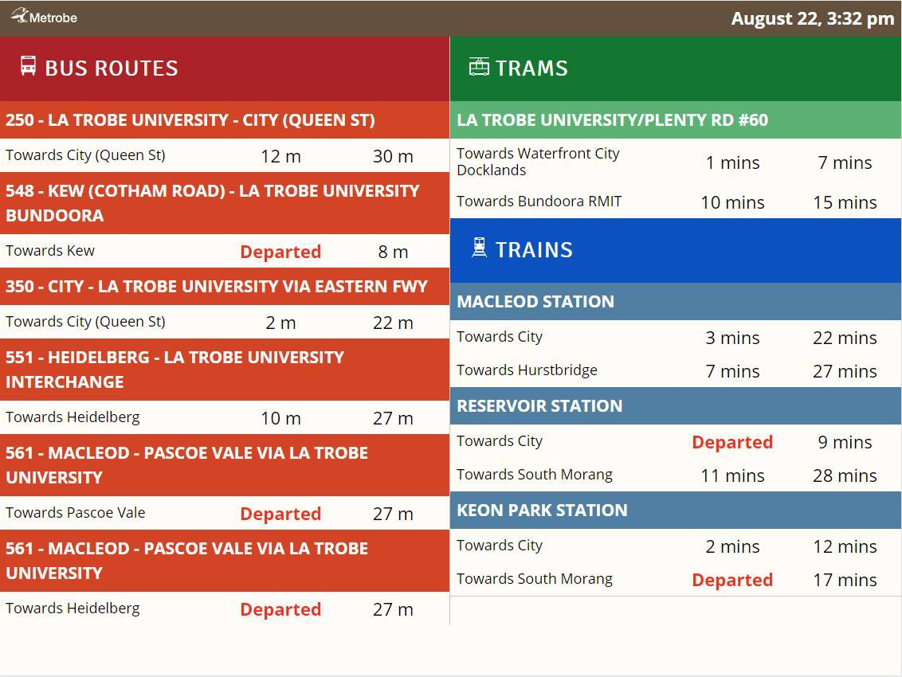

If you look closely, you’ll see a couple of flaws. For one, you’ll see multiple occurrences for the same bus, one for each route or stop, so we hadn’t figured out grouping yet. In addition to that, there’s a lot of text on the screen. That’s mostly because we were taking the line names directly from the API, which returned a lot more information than we really need. For this, we had to build string replacements into the admin interface. We decided for now to hardcode everything, but we made a list of everything we hard-coded, and a part of the team went straight to work on building an admin interface to give a user complete control, thus eliminating any form of hard-coding we had done.

However, for all the flaws we had. There was one that we hadn’t really accounted for. When we started out with the prototype, we started off by pulling only train data, and it worked well. Added in trams, still fine. The minute we started pulling in bus data, the performance hit was huge. It would take over 30 seconds for the page to load. The more devices we tested on, the longer the load times. This was the first time any of us had worked with an API service, and what we were doing was making calls to the service every time the page was loaded, this means that each individual pageload was triggering it’s own API call. Not only was this bad for load times, but it also means we could overload the API and get our developer ID banned.

Our fix to this was to run a cron-job every 50 seconds that made a call to the API, and stored it in an in-memory store (we had opted to use redis for this), and then each time the user loaded the page, they were just making a call to our redis store. Power that with the magic of Server Side Rendering, and we had hit performance that just a week ago, we could only have dreamed of.

## Finalising our UI.

With all that sorted, it was time to start testing our UI. Well, we already had been testing our UI. This time however, it was time to go more large scale. Find out all the little things that was just making it a little too cluttered, and cleaning it up.

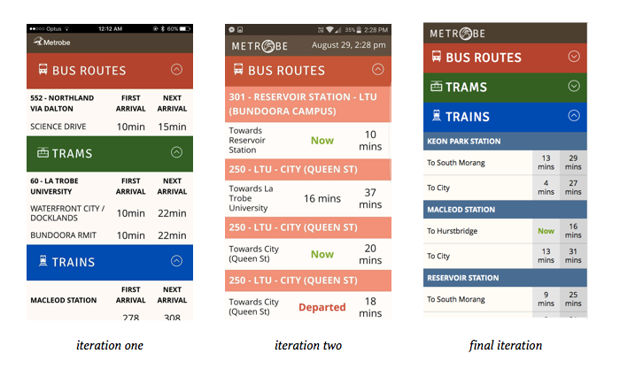

We decided to not implement the mockups we had for the mobile version because it was a little too different from the desktop/kiosk layout, and at the end of the day, consistency was a lot more important than a pretty design.

Taking a look at _iteration one_ on the image above, you’ll see that the repetition of the words “First Arrival” and “Next Arrival” added a lot of unnecessary clutter to the page. Testing it with our prospective users, a lot of people understood what the numbers meant, thus giving us the ability to remove the text without sacrificing functionality.

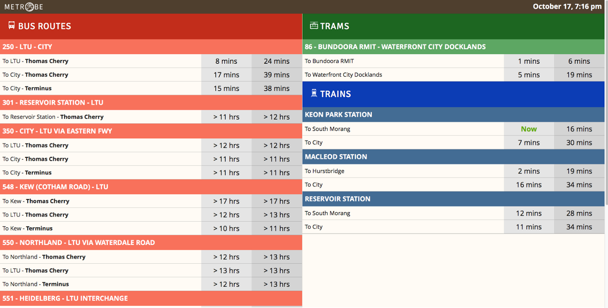

So after copious amounts of testing, we cleaned up the design, tightened up the spacing, added some background colours to the numbers to increase separation and improve visibility, and we had finally landed on a design that not only were we happy with, but one our users were pretty happy with too.

## The admin’s perspective.

In building this app, it had spiralled into much more than anyone had expected it to be. However, we spent all this time and research figuring out the perfect way to implement this for our users, it was now time to tackle the admin side of things. Now, with the admin side, we didn’t have access to as much data as we did when it came to our users. This is because we didn’t really know who the admin would be. Our client was ICT and La Trobe, but when they gave us this project, they wanted to see what we could come up with. Spending all this time building the app however, we realised that we knew the in’s and out’s so well, that we were really just building the admin interface for ourselves, and that’s how we started out.

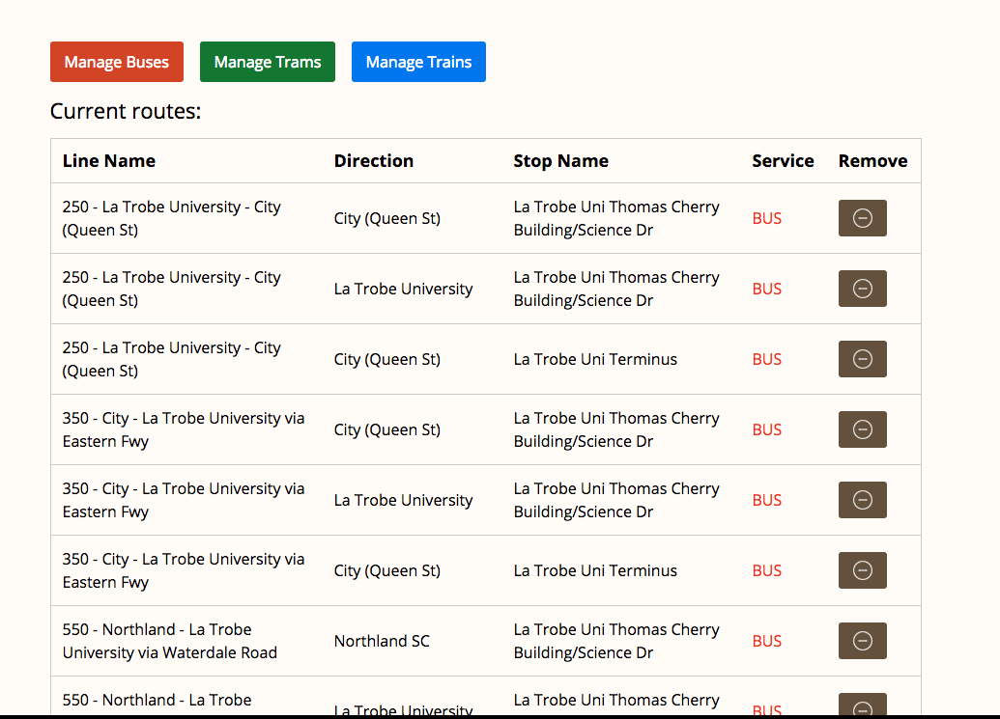

We are lazy people, and anything that made our job of adding and removing services easier, we saw as something that needed to be built. We also took this from the SaaS perspective. Could we, maybe in the future, sell this as a software package? One where an institution or business could buy our software and set it up within a few minutes and no code writing involved.

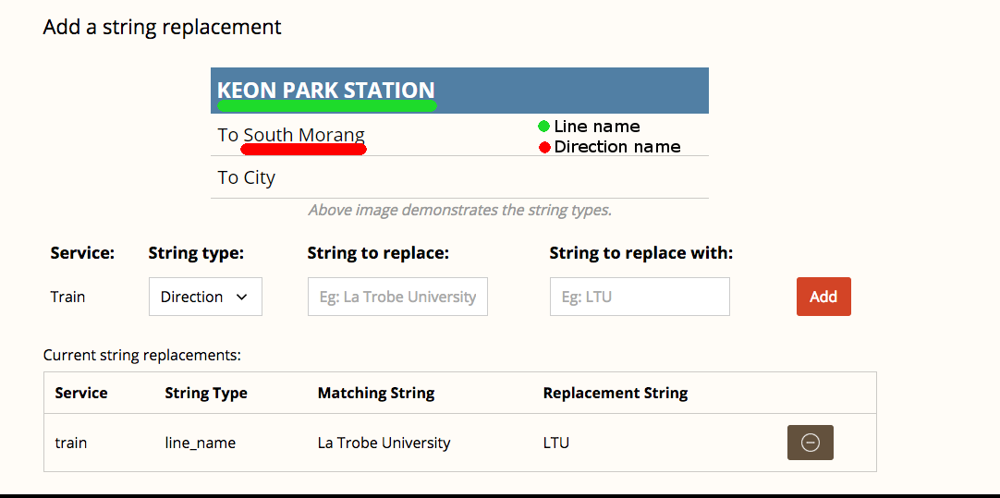

## Closing Statements.

8 months into starting this project, it was nearly ready for it’s initial launch. In around week 8 of the second semester, we were asked to have a public test in the University’s central spot, the Agora. This was mandatory for all the industry project teams. To most teams, this was an opportunity to get some exposure and feedback from students at the university. To us, it was an opportunity to launch with an open beta. We pretty much had the basic functionality of our app down, and our friends had been using daily for a few weeks already, we had the URL ready, it was time to launch.

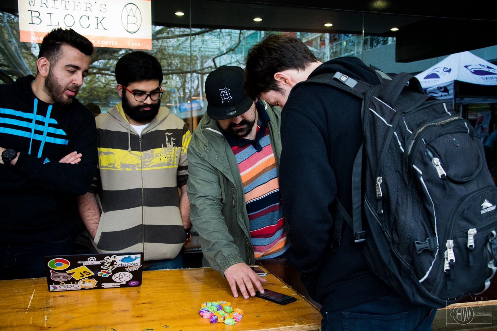

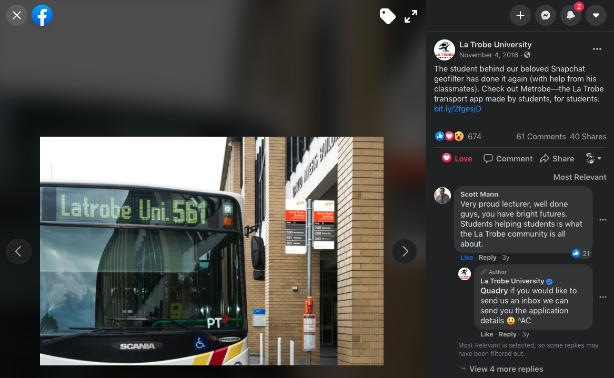

That day alone, we had 173 users. By the end of the week, we had hit 600 users over the 3 day period. At the end of the month, we hit over 3,500 users. However, that wasn’t the only good news at the time. It was also around this time, that La Trobe University chose to share Metrobe publicly on their Facebook page. We hadn’t even had our final client presentation yet, and we were already gaining more publicity than we had expected.

Within days, our analytics data had spiked. Our numbers were climbing on every refresh. Just when we thought it couldn’t get any better, I received a call from Colum, the person in charge of the digital screens around La Trobe. A couple of hours later, and Metrobe was live on every screen around the university, every five minutes, for one minute. Every time we would go to get food, or get coffee, or just looked up while we were studying, every five minutes, we would see our app. There was no prouder moment.

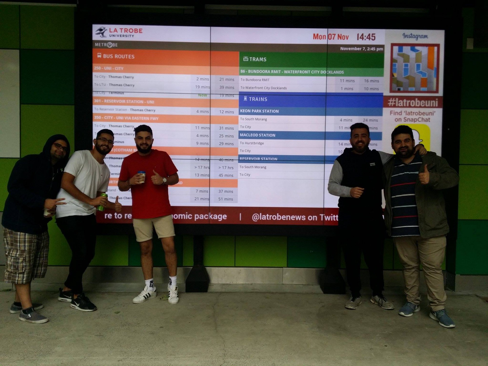

The following week had brought along the beginning of our exam period. Industry Project as a subject, had come to a close. Metrobe had won the best web project at the CS, IT and Engineering showcase, and I had been awarded the Top Web Developer of the year. As a result, work on Metrobe had slowed to a halt. We passed the subject, the chapter had come to an end.

However, Metrobe is no where near complete. There’s still a lot of improvements to be made and features to be added. When they will be added, remains to be seen.

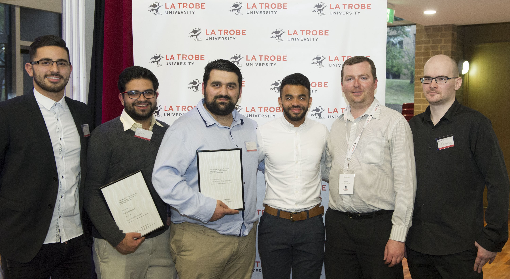

_This report is based on a collective effort of work put in by Rodi Marcus, Rame Jeboo, Francis Malcmann, Joseph Mazloum, Mustafa Demirtas and myself (Soham Adwani). We all had an equal contribution and this app would not have become what it is today without the whole team. We owe an equal amount of gratitude to Shaarang Tanpure, Dr. Scott Mann and the rest of the PRA/PRB family at La Trobe University._

_To our friends and family, we couldn’t have done this without your constant guidance and support, as well as all your feedback throughout the year. To our users, we wouldn’t have anyone to build things for if it wasn’t for you._
