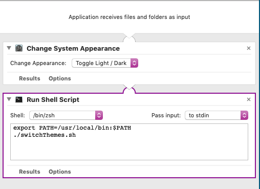
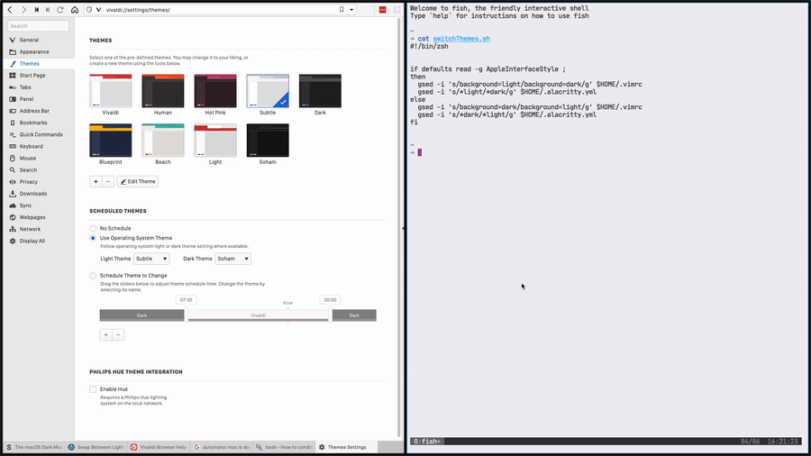

_**Update: June 4th, 2024**_

Okay, so it's been almost 4 years since this post, and a lot has changed. For one, Apple Silicon! Also, about a year after writing this post, I switched back to Linux. Then I switched back to MacOS, and bought a PC. Ran Windows for a while, decided it was trash, now I use Arch btw.

Anyway, back to the autoswitching. Turns out, way easier to do it on Linux. Dark to Light used to suck on Linux, but then Plasma 6 for KDE seems to have fixed most of that (as long as you stick to the default breeze theme). Now, all I have to do is open system preferences and change my Global Theme. When that happens, all of my main apps (Brave, Discord, Standard Notes, Betterbird) will switch over. WezTerm is my new terminal of choice, that one required me writing a small script - [which they teach you how to do](https://wezfurlong.org/wezterm/config/lua/wezterm.gui/get_appearance.html) - and that was set. Then, all I had to do was to write a fish function that uses \`sed\` _(see below)_ to swap out the colors on neovim, fish and starship (my prompt of choice now) and that was all done. It's mostly automatic, except the colors in the terminal which require me running \`source $HOME/.config/fish/config.fish\` again, but way easier than it was like 2 years ago, let alone 4.

\--- end of update ---

From the title, this should sound like something pretty simple. However, as most things in the programming world, nothing is as simple as it seems.

If you're familiar with Mac OS, you'd know that in Mojave, Apple introduced Dark Mode. This was probably my most awaited feature in Mac OS ever. I know it doesn't seem like that big a deal, but to me, it really was. I already had my code editor (vim) and terminal with dark backgrounds, so having everything else bright was super jarring. Ever since Dark Mode came out, I've had it enabled across all the websites and apps that I use on a daily basis, and never looked back. Granted a few sites here and there still don't have dark mode support (looking at you, Google and Asana), but for the most part, everything has been super great.

However, lately, as I've been working from different areas of my house, some with more natural light than others, I've been considering giving a few light theme's on Vim a shot. The problem is, it's a hassle to change everything when I know I'm going to need to change it back when the room gets darker.

### Enter, Scripting.

I knew immediately that this was something I should look into automating. The first step was research. I needed to look into what all I needed to change. Luckily, most apps and websites these days respect the system theme. So if you change from Dark to Light on Mojave, apps like Microsoft To-Do and Vivaldi auto update to match, and websites like Twitter also respect the \`prefers-color-scheme: dark\` media query. However, my two most used programs, Alacritty and Vim, are targetted towards being as cross-platform as possible, and thus don't really tie in specifically to Mac OS configurations.

Not to worry however, as I knew that was an easy fix. Alacritty and Vim are both configured using files stored in your root or .config directory (aka dotfiles), and switching themes is as simple as editing those lines. To test out how easy it would be, I tried running \`sed\` directly on the command line to change out the theme in my \`.vimrc\` and immediately ran into an issue.

I'd used \`sed\` before and it worked fine, but for some reason the exact same type of code didn't work here. A quick search on StackOverflow led me to my answer, the Mac version of \`sed\` looks for files with specific extensions, or each file needs to have an extension for it to work. In this case, that threw an error because dotfiles don't really have extensions per-say. The quick fix for me was to use homebrew to install \`gnu-sed\`, a port of the proper unix sed to Mac OS. Ideally I would've liked to figure out a way to do this without adding external libraries and extensions, but I figured I was pretty much making this for me and not many people will have the same use case as I do, so I just wanted to get it working first and then tweak it later.

Here's the script I used;

#!/bin/bash

gsed -i 's/\*light/\*dark/g' $HOME/.alacritty.yml

It worked like a charm. Alacritty has live reloading, so I was able to see the changes instantly. I did something similar with Vim, by setting \`background=light\` and that worked great as well. Ok, great, I now had a way to switch both my terminal and my mac, to dark/light mode. However, this still had to be set manually, and it wouldn't toggle. I now had to figure out how to tell which mode my Mac was in.

### Did someone say Defaults?

Luckily, there's a super easy way to interface with Mac OS through the terminal, and that's the \`defaults\` command. Specifically;

defaults read -g AppleInterfaceStyle

On dark mode, this returned "Dark". However, switching over to light mode, it threw an error stating "_The domain/default pair of (kCFPreferencesAnyApplication, AppleInterfaceStyle) does not exist_". It took me a while to tinker but then I figured since it's an error, I could essentially treat the defaults statement as a boolean and wrap it in an IF statement.

So after which, this is what my script looked like

#!/bin/bash

if defaults read -g AppleInterfaceStyle ;
then
  gsed -i 's/\*light/\*dark/g' $HOME/.alacritty.yml
  gsed -i 's/background=light/background=dark/g' $HOME/.vimrc
else
  gsed -i 's/\*dark/\*light/g' $HOME/.alacritty.yml
  gsed -i 's/background=dark/background=light/g' $HOME/.vimrc
fi

Interestingly enough, this didn't work. I mean it did, but it wasn't what I expected. I thought it wasn't working, but then I quit Alacritty and opened it up and it had worked, so just the live reload wasn't working. Trial and error led me to the conclusion that adding the gsed command for Alacritty _after_ Vim was the only way to get it to work. Now that that was done with, it was time to figure out how to toggle the system theme from the command line.

### Automator.app

Long story short, it can't be done from the command line. Now I was hesitant to tinker with Automator.app, but honestly I don't know why. A few google searches later, I was super excited to give it a shot. I had no idea it was _that_ powerful.

So I created an app in automator, dragged in the Toggle Dar / Light mode option, and it worked. Next step, drag in \`run a Shell script\`, have it run my \`./switchThemes.sh\` file that _I had already tested and knew was working fine_ and, oh, it didn't work. I thought to myself, _"maybe its a permissions thing?",_ **nope.** I'll save you the stress, but somehow using \`/bin/bash\` didn't work but using \`/bin/zsh\` did. So I updated my script and oh, gsed can't be found. I realised I probably should have expected it to not have access to my path. Another google search later and I found the answer.

Yep, all I had to do was export my PATH first and it worked. I saved it as an app in my documents folder, and a surprising benefit, was being able to run it via spotlight, as demonstrated in the gif below.

So that's it right? I'm done? Nope. You see dear reader, it's never that simple. I've always used a solid black background as my desktop background. However, with Light Mode, the solid black kinda looked out of place, and I wanted to swap it for a teal or light grey variant.

### Research, more research

I found a few days to do this via terminal that seemed to work, but it would only do it on the Virtual Space that I was on currently. I tried a bunch of different applescripts and even tried creating my own dynamic wallpaper for mojave, but that has its setting set by the position of the sun and as far as I can tell, there's no way to do this based on the system theme. If you know a way to do this, please reach out!

My next step was, and yes I know I really shouldn't have, to look for a third party library. I had heard good things about \`[m-cli](https://github.com/rgcr/m-cli)\` so I installed it. I really should've checked the issues first, because as soon as I ran it, my Dock and Mission Control disappeared. Restarting didn't help, \`killall Dock\` didn't work. Some searches later and I learned I had to go into \`Library/ApplicationSupport/Dock/\` and delete an sqlite db that's used to store your wallpaper configs.

So I decided to settle on an earlier applescript that worked for multiple monitors, but not multiple virtual spaces, which you can see below

#!/bin/zsh

if defaults read -g AppleInterfaceStyle ;
then
osascript -e 'tell application "System Events" to tell every desktop to set picture to "/Library/Desktop Pictures/Solid Colors/Black.png"'
  gsed -i 's/background=light/background=dark/g' $HOME/.vimrc
  gsed -i 's/\*light/\*dark/g' $HOME/.alacritty.yml
else
osascript -e 'tell application "System Events" to tell every desktop to set picture to "/Library/Desktop Pictures/Solid Colors/Silver.png"'
  gsed -i 's/background=dark/background=light/g' $HOME/.vimrc
  gsed -i 's/\*dark/\*light/g' $HOME/.alacritty.yml
fi
 

In conclusion, the search to perfect my theme toggle app continues, but for now, this will do. If you wanna set this up for yourself, you can probably piece together all the code from the above article, or just reach out to me and I'd be glad to help.

_**Side Note:**_ In Vim and Alacritty, I'm using a theme that has both a light and dark variant as part of one theme. I set this up using https://themer.dev, which is honestly the best tool for theme's and colorschemes.
