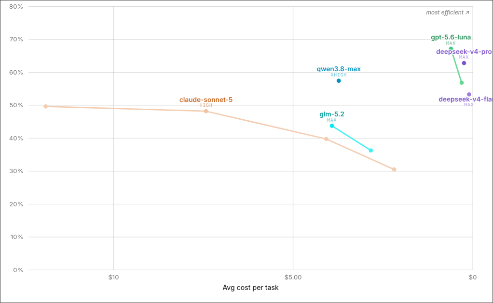
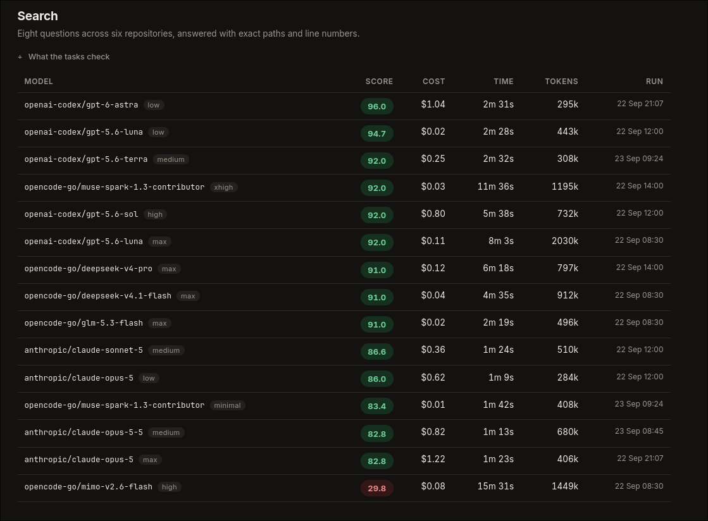
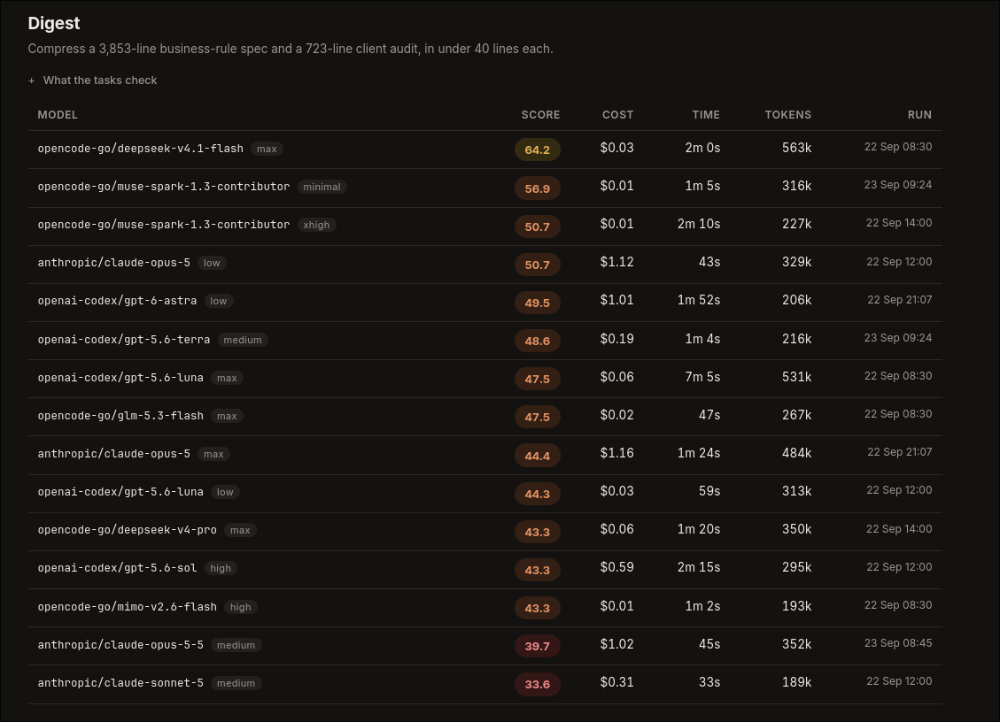
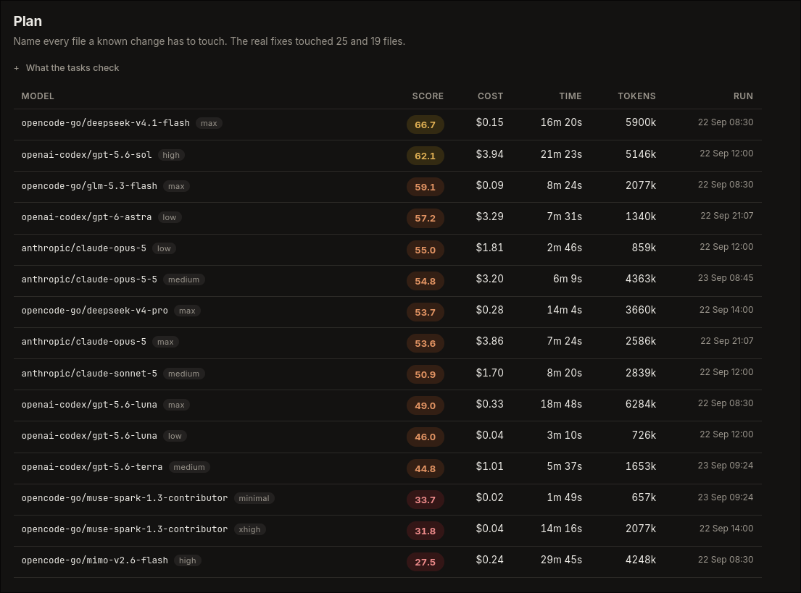
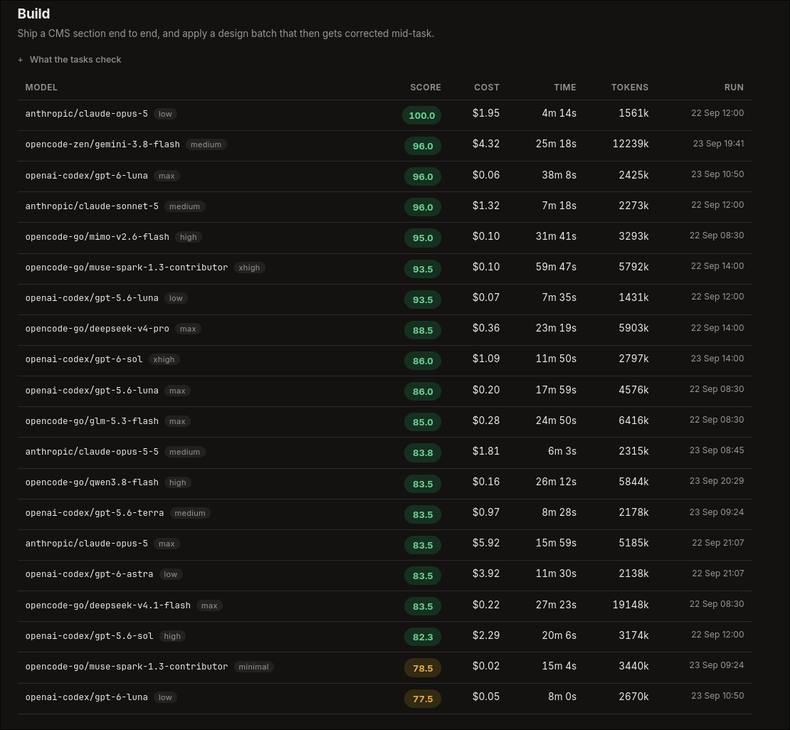
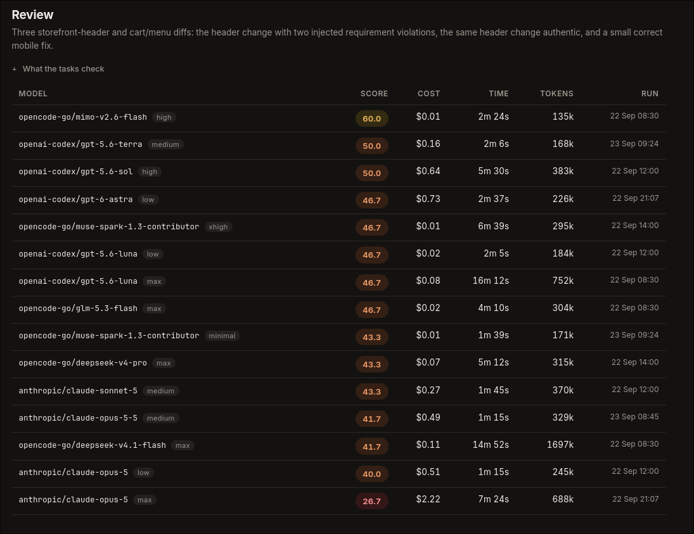

### The Epilogue

Well, here we are. I thought I wouldn't be too invested in the whole AI thing, but I guess I was wrong.

While life itself has been more of the same, the way we work, or at least we in the tech space, has changed a lot in the last year or so. A year ago, AI was just a chatbot in the browser that I used to bounce ideas off of. My devs had started using it here and there, but I still hand-coded when I needed to code, cause clearly I am one of those get off my lawn people.

Today however, that looks completely different. 80% of my workday is spent inside herdr (rip my love for tmux). I still make all the decisions, but I only ever open up nvim to code when it's a one liner fix, that using AI would be a waste of tokens for.

This means I have spent an exhaustive number of hours playing with AI models. I have 3 subscriptions: Claude, ChatGPT, and Opencode Go. In the beginning, I just defaulted to Claude for everything. Then, as curiosity often does, I gave Opencode a shot and found that a lot of my day to day work was done faster and cheaper using lighter models, rather than Sonnet and Opus, which felt heavy. That's when I had a split workflow, claude for big decisions and heavy tasks, and opencode (with whatever the model flavour of the month was) for the smaller faster tasks. I especially liked Kimi K2.5 for quick builds and UI work.

Then, a couple of months ago, everything started to change. Fable came out, then Opus 5. Suddenly, my YouTube algorithm was filled with constant \[X NEW RELEASE COMPLETELY CHANGES THE GAME\] thumbnails, and it felt like we were getting a new model every week.

I started writing this blog post on the 22nd of September, and I have woken up today on the 23rd of September to yet another new release from Anthropic, Opus 5.5.

_Note: After publishing this post, I found out about GPT-6-Luna and Sol, which I also later benchmarked, the only section truly affected was build, so I have updated that part of the post as well._

Here's the thing though, the more new models we were getting, the worse I felt using them. If the YouTube hype train and the syntethic benchmark bros are to be believed, you should only be using the highest model on the max setting to get the best results. For a while, that's what I did, until Opus 5 kept burning out of my 5-hour limit within 30-40 minutes. However, that wasn't the worst part.

If you've used Opus 5, you'd have heard about the great prose dilemma. Opus 5 is smart, but sometimes acts too smart for it's own good. It would spit out walls of text and jargon that could have been answered in one sentence. No combination of unslop skills and agent instructions could get it to work, and finally it was time for me to look elsewhere.

I'd heard good things about the new 5.6 class from OpenAI: Sol, Terra and Luna, so I renewed my ChatGPT subscription once more. I used it for a while, and surprisingly, Terra ended up being my default model. It felt like I never ran out of usage with Terra, and didn't need the frontier power of Sol. Terra's output was much more direct and coherent, and it just did the work without getting in my way.

That was of course, until it didn't. I'll skip over the whole story cause this post is getting a little long, but I ended up discovering benchmarks and moving to Luna on max, because DeepSWE had it as the best score with the lowest price. See this image below that I put in the Otterdev group chat, telling my devs that moving forward we'd be using Luna on max as our default model company wide, with DeepSeek v4 pro for harder tasks.

Shortly after that message, ox-alpha-free took twitter by storm, and a week later we found out it was GLM 5.3 flash, a model touted as Opus 4.8 level reasoning at lower than Haiku prices. It seemed to good to be true, but shockingly, it wasn't.

Don't get me wrong, 5.3-flash wasn't the best, but it was mostly close enough, and so fast that it didn't matter if I needed to steer it in the right decision. As an agency with a lot of CMS projects, sometimes my devs are all on tasks and a request from a client comes in. Now, being the impatient soul I am, I don't like adding things to a queue, so I usually just handle it myself. Say a request comes in to update a specific component, Opus may one-shot it, but take like 15-20 minutes. With GLM flash, I'd tell it what to do, it would say it's done in under 2 minutes, I'd check, give it a feedback prompt maybe once or twice, and then it'd be done. Total time run, under 5 minutes. Yes, Opus is more set and forget, but for me and my workflow, I'd take faster & cheaper over self-sufficient any day of the week. If this was Ironman, I'd be skipping Jarvis for Dum-E and U.

### A New World

Talking about Jarvis, watching Avengers Age of Ultron again got me thinking. A suit of armour around the globe. Nah, I kid. It got me thinking about Agent Orchestration. I had played around with enough models to know what I liked for specific tasks. Need a plan? Opus 5 max. Need that planned digested and summarized in plain english, and vetted for legitimacy and holes? 5.6-Sol-xhigh. Need to find a bunch of occurrences of a section across a codebase? Luna low.

The problem with that was, I was doing it manually, when I know I didn't have to be. I had already moved from tmux to herdr, and supposedly herdr was agent friendly and completely manageable via the CLI. At this point, I had also already moved away from opencode and claude code as my harness, opting for oh-my-pi instead. About 45 minutes later, I had my dream setup working, and it's something I've been using daily for the past 5 months.

I have a @default role for my main agent. This is the one I start sessions with. If the agent is going to traverse a large codebase and read a bunch of files, it sends out a @scout to do it for cheaper and send back a summary. If it's going to build out a frontend, it sends out @build and here's the kicker, I don't check and steer build anymore. Default does that, and only pings me when it's unsure (which still happens quite often, but again, I'd rather steer and get good speed than let the AI make all the decisions). While most of the orchestration happens automatically, I also have the ability to do it manually. Which means that if I know this agent is about to do something that another model would do better, I specifically tell it which model to use and how to steer it.

This was a gamechanger for me. No longer was I obsessing over finding the best model for me, but I was now obsessing over finding the perfect model for each specific task. That is when, the third idea hit.

### A benchmark, but tailored

The idea hit me yesterday when MiMo v2.6 flash and pro came out. Everyone on Reddit was going bezerk over it, how it was better than Deepseek 4.1 and Glm 5.3-flash. So, I gave it a shot. I switched to it and had it go at one of my tasks. Immediately I found that it felt good at some things, like it's output was coherent and clear, but it was probably the worst overthinker since Kimi k2.6. A tonne of "ah, wait, maybe I should X! But no, this, but also that!". That is one of the most frustrating things a model can do in my opinion. So, I decided to check. I pull up DeepSWE, not there yet. Then I was looking at DeepSWE, and thinking about how it doesn't really actually seem to match the ideas I have built up. For example, it has Deepseek 4.1 flash way higher, while I have it way lower than GLM 5.3-flash in my gut test. So I looked around at all the other benchmarks and what they actually check, and I felt like none of it match what I care about. Yes some of them check how well a model writes a React component, and while we primarily use Astro, that does kind of carry over. Most of the benchmarking however looks at a criteria I honestly don't care about.

Once again, a brainwave hit. I use oh-my-pi for everything. Oh-my-pi has session data for all the actual work I've been doing in the past however many months. Exact tasks I do, how I steer the agent, where they fuck up and what ends up being the accepted solution. All the data you would need to build a perfectly tailored benchmark for yourself.

So I pull up a new session and send out Fable and Astra agents to go to town on my data. Summarize all my conversations and group them into tracks. Took a couple of hours of me and the agents (and waiting for credit resets) to digest all the data and figure out what actually mattered before we had it - the perfect benchmark tailored exactly to my workflow. Five tracks, each built to trigger that role's specific failure.

Search: eight questions across six repos, answered with exact paths and line numbers. Catches invented file paths and miscounted sets.

Digest: squash a rules spec, analyze a client audit, give me a summary. Catches dropping the condition that made a fact true, like flattening a two-basis revenue rule into one.

Plan: Admittedly, an actual "Plan" agent requires more of the eye-test, as how a plan is written is very subjective. So for this benchmark, what it does is kind of like an advanced scout: name every file that a known change much touch, make sure that a change that we plan on making won't break anything else in the codebase.

Build: ship a CMS section end to end, apply a design batch that gets corrected mid-task. Catches something building that never renders, collateral damage, and failure to take a correction.

Review: one diff with two planted violations, the same diff authentic, and a correct seven-line fix.

Scores are per track out of 100 and never averaged, because the five measure different jobs.

### The Results

Oh boy when I tell you I had a field day yesterday once this was built. Thankfully yesterday was an admin-heavy day for me, which means I wasn't using much of my LLM token usage, and was free to send out a bunch of benchmarks. Now, let me preface this by saying all syntethic benchmarking needs to be taken with a grain of salt, because its all very specific to certain workflows and tests. It doesn't cover every scenario, or even many scenarios. I myself do not take these numbers as gospel, and more like guidelines to see what a specific class of model is good at.

Now, let's talk about what we saw, cause boy did this challenge the ideas I held.

#### Search

Search is one that doesn't shock me much. The cheaper, lighter models scored higher and did them faster and cheaper. As expected. The thing that shocked me however, was MiMo v2.6 flash. For a flash model, it took way longer than the rest of them, and scored the lowest.

While Astra scored the highest, the fractional score advantage doesn't make up for the cost difference, meaning Luna:low stays as my default scout.

#### Digest

The first shocker of the bunch, but also the first caveat. On paper, Deepseek almost doubles the newly released Opus 5.5 at a fraction of the cost, with Muse Spark 1.3 on minimal thinking coming just under, while being even faster and cheaper. In practice, I have found that while that is mostly true, a better result can be achieved from combining Deepseek 4.1 flash with something a little smarter, so deepseek gets the first summary and makes it as verbose and detailed as possible, and then your smarter model like Sol or Opus condenses it down for you to something more readable.

#### Plan

This table is the only one I'm a little concerned about. I mentioned above how Plan is something that is a bit more subjective, and I can't wrap my head around a flash model scoring higher than a smarter thinking model, so I'm going to need to play around with these results a bit more and perhaps fine tune this benchmark.

#### Build

This is where it is clear to me that my initial reference point for coding tasks, which was a combination of DeepSWE and the AI Arena Web Development benchmark, was the wrong fit. I had assumed that even though it was a straightforward build task, a model slightly better at reasoning and thinking would work better. The results however show that based on the way I write my prompts personally, a model that's more focused on just doing what it's told and not thinking actually does score higher. One thing that stood out was that Opus 5 on low was the only model that scored a perfect 100, while not being too expensive compared to the rest of the frontier models, and taking the least amount of time. That being said, GPT luna 5.6 only scored a little bit lower, while being almost as fast and way way way cheaper.

#### Review

Here's another group that I think needs some fine tuning. I have 5.6 Sol high as my default reviewer, cause again, thinking logically, you'd assume that the smarter model would be the best at reviewing. Sometimes however, I do send reviews out to Opus 5 max, which somehow scored the lowest of all. I'm going to need to dig into these results a little more, but if this is truly indicative of actual performance, switching our internal PR review bot to MiMo v2.6 Flash is going to save us some decent cash in the long run.

If you'd like to browse around the results yourself, I have [published the results here](https://snazzyham.com/bench), and will be updating them as new models release... I mean maybe I will.

### The Update

Turns out, things are not always what they seem. I mean, I expected needing to make tweaks to the benchmark, so all well and good there. Anyway, since publishing this post, I actually did a lot more benchmarking. Maybe like 20ish more models and weights. Especially since new models like Opus 5.5, Sonnet 5.5, Sol 6 and now even Sol 6.1 have come out. One thing I kept noticing as I did more benchmarks, is that some scores just didn't make sense, and that's really something you can't tell until you run a bunch of tests to see the score. So anyway, after gathering enough data, I fixed up more of the benchmarks, re-ran some tests, re-graded a bunch of scores. For example, in Plan, Gemini initially scored way higher, but that's because it found some /tmp file somewhere that had the answers. Some models were getting graded lower than they should have in Build because they touched the files CLAUDE.md asked them to, but the grading system penalized them for it.

Anyway, I'll be updating the benchmark as time goes on and I find more things, just wanted to drop that note here so that no one looks at the screenshots and wonders why scores changed.
