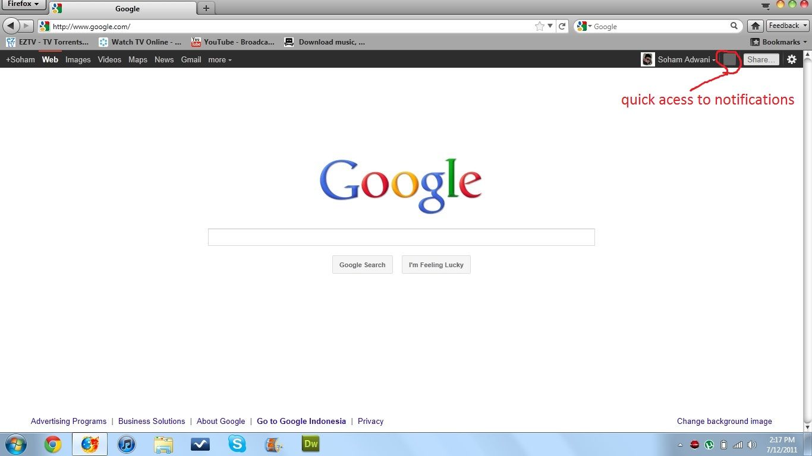
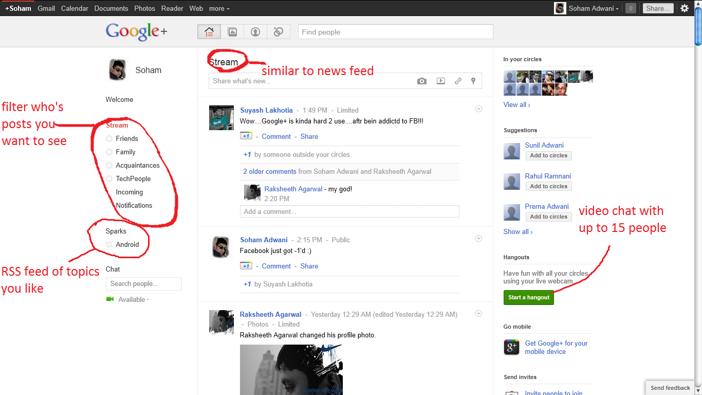
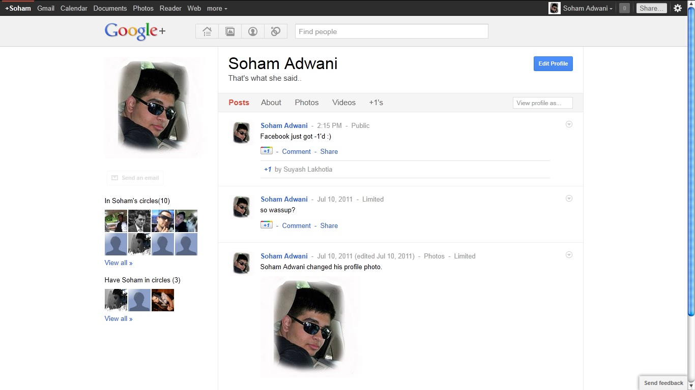
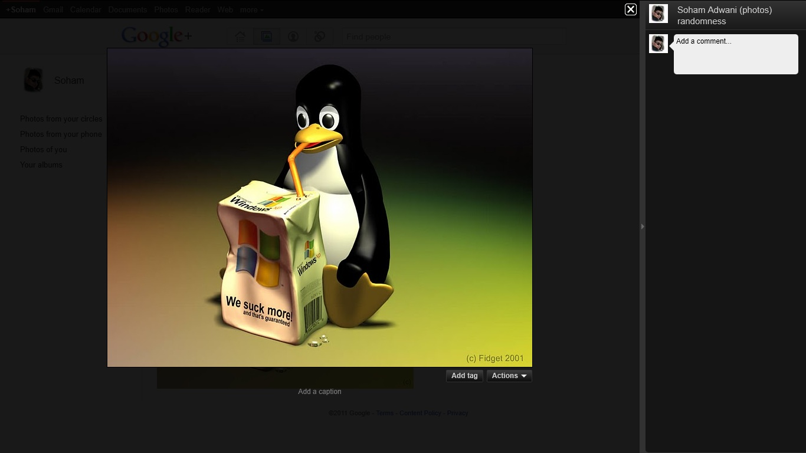
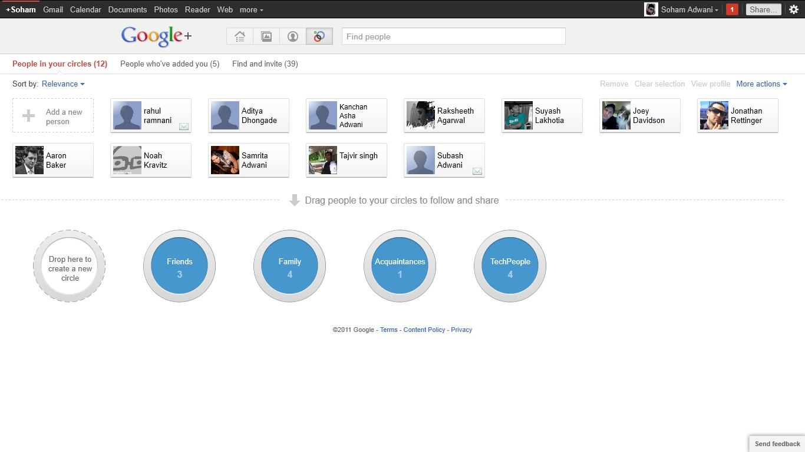

Many of you may be aware of Google+, Google’s all new social networking site competing with the ever so popular facebook. Many have mentioned how confused they get and how hard it seems, well its not that hard, so heres a brief description of what you can expect to find.

1.  Google Homepage

as you can see, the homepage of Google’s main website has been altered to provide the all new + bar, which will give you quick access to a new post or notifications even if you’re away Googling!

Besides the Web tab now is the +You tab, which will bring you to your Google+ homepage, or you can just type plus.google.com

1.  Google+ Homepage

Here you can see the homepage, which consists of basically everything a social network’s homepage should have. In the middle you have the Stream, which is similar to your news feed on facebook, except for the fact that its clean and not full of junk and spam. on the left you have the choice to filter your stream from your different circles (groups of friends) which we will get to later. below that you have sparks, which is a kind of RSS feed of topics of your interest, similar to liking pages on facebook, but less obtrusive, meaning you can choose if you want them to appear in your stream of just under sparks. On the right hand side of the page you will find a thumbnailed list of people in your circles and suggestions for people you might want to add or invite.

below that you have the option to start a “hangout” which is a video chat for up to 15 people. you can choose to start a private hangout with your individual circles or make it public for anyone to join.

1.  Profile Page

moving on to the profile page. its all the same except for a few minor tweaks. you can choose to view the persons posts, information about that person, or view their photos/videos and things they’ve +1’ed (liked). below the profile pic, you can view who they're following and who’s following them. similar to twitter, i think (i don’t really use twitter much)

1.  Photo Viewer

what i would like to consider a much drastic improvement over facebook’s photo viewer, you can view and scroll through the pictures from the larger part of the screen, and comment on the right comment pane.

1.  Circles

Last but definitely not the least we have the circles page. this is probably the most stand out feature of google+, you can search for people and group them to different circles, such as friends and family, etc. the best part? you can add 1 person to more than one circle, such as if you want to group them as friend and coworker, you can. you can then choose to share things specifically with just one circle, various circles or publicly, for anyone to see. and for you extremely social peoples, you can have an unlimited number of circles.

well, i hope this has made you understand Google+ more, any questions? need an invite? sound off in the comments.
