Kitchen tools, like many other things in my life, fascinate me. I alluded to this a bit i[n my previous blog post](https://snazzyham.com/writing/thoughts-on-kitchen-equipment/). I guess the obsession with tooling has always been around in one way or another. Tools, at their essence, are things that help us get shit done. The more you do a certain thing, the more you want your tools to be reliable and useful for you. Using tools that you like also helps with the joy factor of whatever you're doing. This happens in every industry and hobby, from design to fishing. It's why golfers are obsessed with changing their clubs and finding the perfect club. I even wrote previously about [software development tooling](https://snazzyham.com/writing/the-2024-version-of-tools-i-use/) that had a huge impact in my life and career.

Another thing about kitchen tools that fascinated me to begin with, is longevity. I'll be the first to admit, growing up, I always just bought the thing that got the job done. I never thought about how long it would last me, whether the quality made a difference, how good it felt to use, etc.

However, as I've grown older, and let's be honest, as I started earning better and having more to be able to budget for discretionary spending, quality and longevity have started playing a bigger role in my purchasing decisions. Now, that's not to say I've started buying the most expensive thing. In fact, a majority of my purchase decisions go against what the current trend is and more towards the old reliable. Take for example this blog post, I'm typing it on a second-hand, 4 year old thinkpad t14s that I just bought last week. I already had a Macbook Air M1, which arguably has quite a few better features than this laptop. However, that "tool" did not bring me joy. This one does.

To be fair, it's not just kitchen tools that I've started applying this ethos too. I buy shoes based on their likelihood of surviving and being re-soled, clothes that are made of more premium qualities. I've never been a big 'brand' guy, so maybe that's a part of it too.

There's this phrase; "You never really own a Patek Philippe, you merely look after it for the next generation". While most people like to trick themselves into thinking this applies only to the swiss watchmaker, the term was actually coined by Leagas Delaney, a british ad agency, back in 1996. As someone who's worked on their fair share of ad campaigns, I know all too well that slogans are merely coined to sell a feeling, making them a verbal reflection of a brand's desired emotional legacy. This slogan however, could apply to anything that is well made, and crafted with the utmost care and quality. Hell, my dad has a pair of leather shoes he got from a cobbler on the side of the road in Bergamo for 30 euros, and my grandkids would probably still be able to use them. What I'm trying to say is, price and brand name are not the driving indicators of longevity.

Before this post turns into a rant on society's obsession with brand and status, let's flip it back around to kitchen tools. People have been cooking for centuries, and sometimes, you reach a point where innovation slows down. I believe they call that maturity. I think kitchen tools are in that state now. With the advent of fast, cheap manufacturing, newer kitchen tools today are a hodgepodge of single use plastic pieces of shit that probably could be replaced with a knife.

Walk into any professional kitchen today, and their choice of tools are probably identical to something you'd find in a french kitchen in 1973. Aside from maybe induction hobs. I hear those are pretty good.

Wait, this is supposed to be a list of tools I use right? whoops. Anyway, I'm going to split my tools into 3 categories - **Prep**, **Cooking** and **Maintenance**.

## Preparation (or, mise-en-place, if you roll that way)

Probably one of the most overlooked things in cooking, because most people would probably outsource this part wherever they can. [Businesses have been built on the idea](https://www.epicurious.com/shopping/blue-apron-review) that people want to cook and still hate doing prep. I personally, love the prep. Partly because of the peace I get from cutting spring onions while Slow Dancing in a Burning Room plays in the background, and partly because I don't really trust anyone else to prep the way I would.

### My Knives

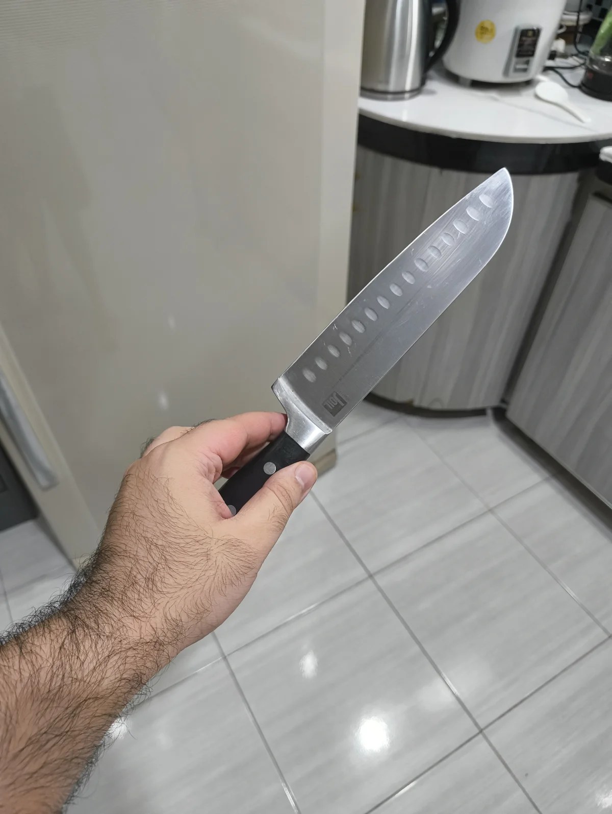

The first real knife I enjoyed using, and still use quite regularly, is this [Joil santoku](https://www.tokopedia.com/joil/pisau-dapur-baja-santoku-knife-stainless-steel-tajam-joil-n2). It was cheap, really cheap. It's made from a softer steel, and while it says Santoku, it's more of a western knife masquerading as a Japanese one. I bought it before I knew about different steels, different styles, etc. While I have better knives now, this one still serves as my beater, something I use without caring too much about it, and I even use it to practice sharpening on, because I won't do that to my nicer knives unless I'm confident. More on that in the maintenance section.

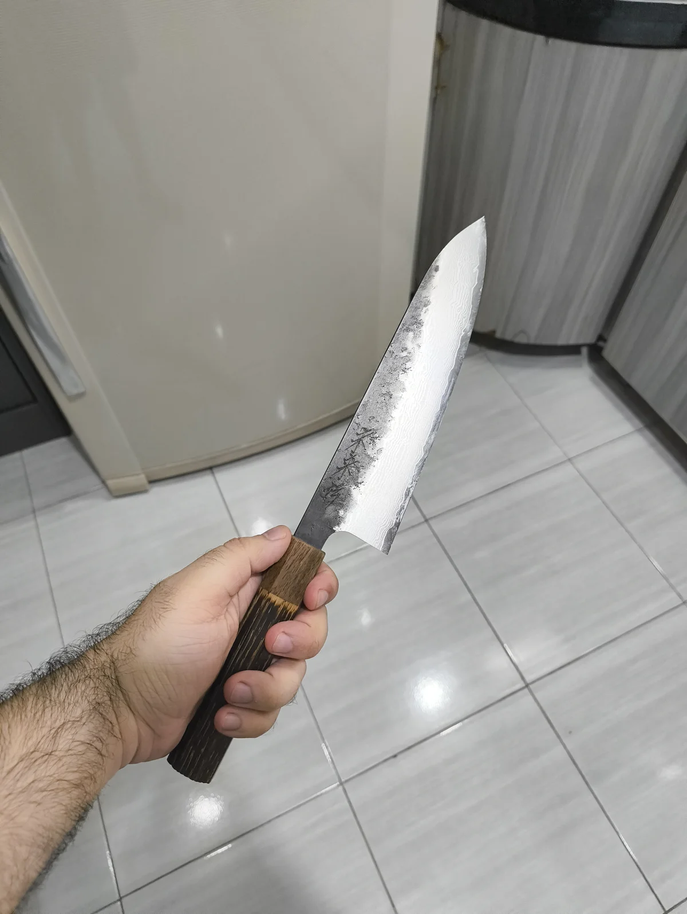

My next knife also happens to be my favourite. An 8-inch Miraiden that I picked up at Tower Knives in Osaka. It features a damascus VG10 blade. Now I'll be honest, I did plan a trip to Osaka mainly because of the idea of buying a knife there. However, I didn't really do any research at the time. I just wanted to wing it. What I did know is I didn't want carbon steel, and I did want a japanese handle. Anyway, I went down to Tower Knives with my dad, tested out a bunch of different knives, vibed with the team there and even had them give me a sharpening demonstration. I ended up feeling most drawn to this knife because of how it felt in my hand, and the cutting feel.

Honestly, since getting it, I haven't used it much. Not because I don't like it. More so because I want to be able to take care of it properly, and I don't want it to get dull before I've properly learned how to sharpen on a whetstone.

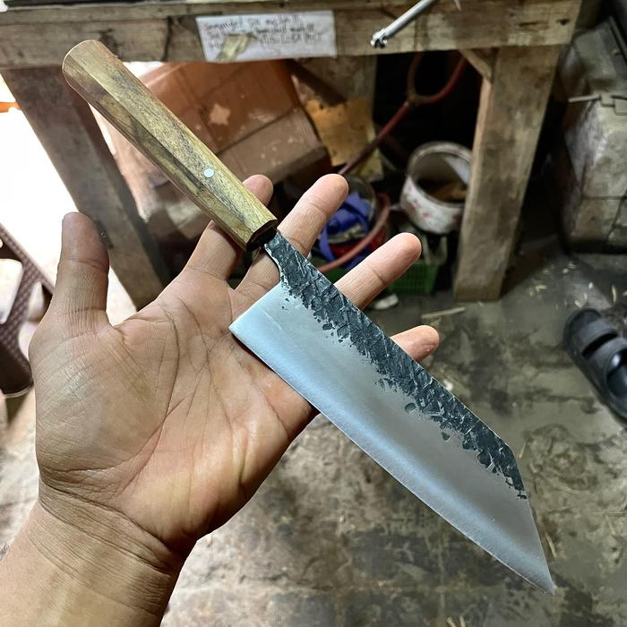

After coming back from Japan, I realized I probably should've also picked up a beater, which wasn't as expensive as my Miraiden but also more of a japanese knife than my Joil. I ended up finding this cheap Carbon Steel knife on Tokopedia, which looked dope. Too bad when it arrived it was way too thick, too big, and terrible to cut with. It felt like using a sword. I tried sending it to a sharpener to get it thinned, and even tried sanding it down. Still kinda sucked. It lives in the cupboard now. After that knife is when I did more research on steels.

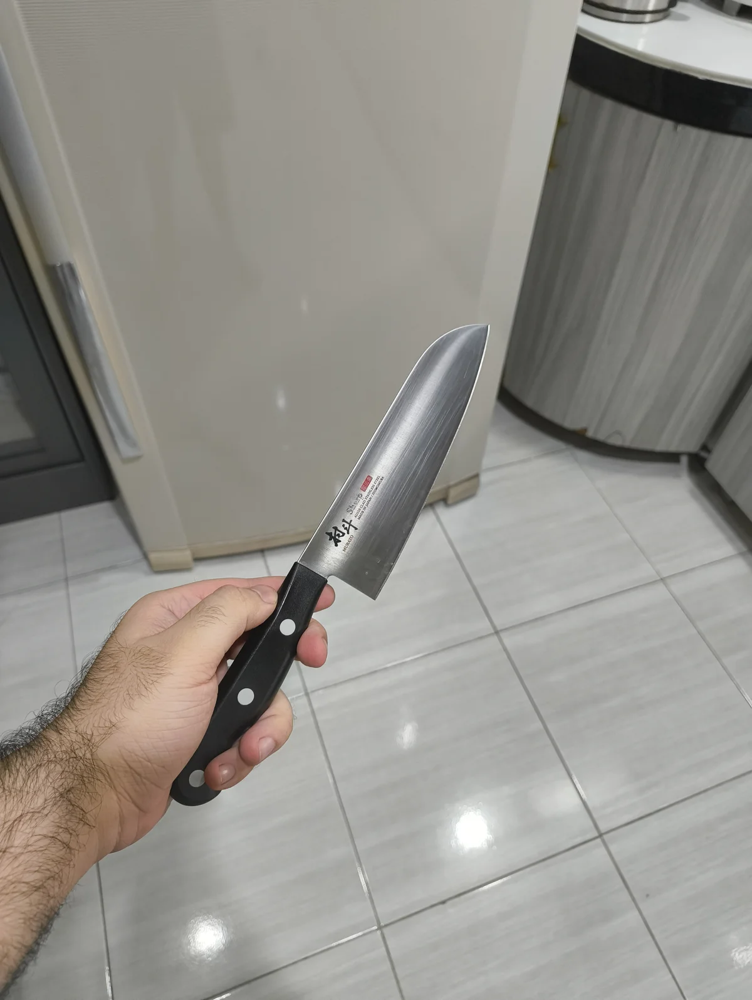

Which lead me to my mid beater. Technically, I didn't need this knife. I just wanted something that was a Japanese knife, but also not my Miraiden. It came down to this and a Tojiro DP3. Similar steels, similar prices. At the end of the day, I picked this instead of the Tojiro for one super shallow reason. I saw a Tojiro in Osaka and I didn't buy it, so buying one in Jakarta would just feel wrong. This is called the **Shimomura Murato Sharp** and uses AUS10 steel, which is similar to the VG10 in my Miraiden.

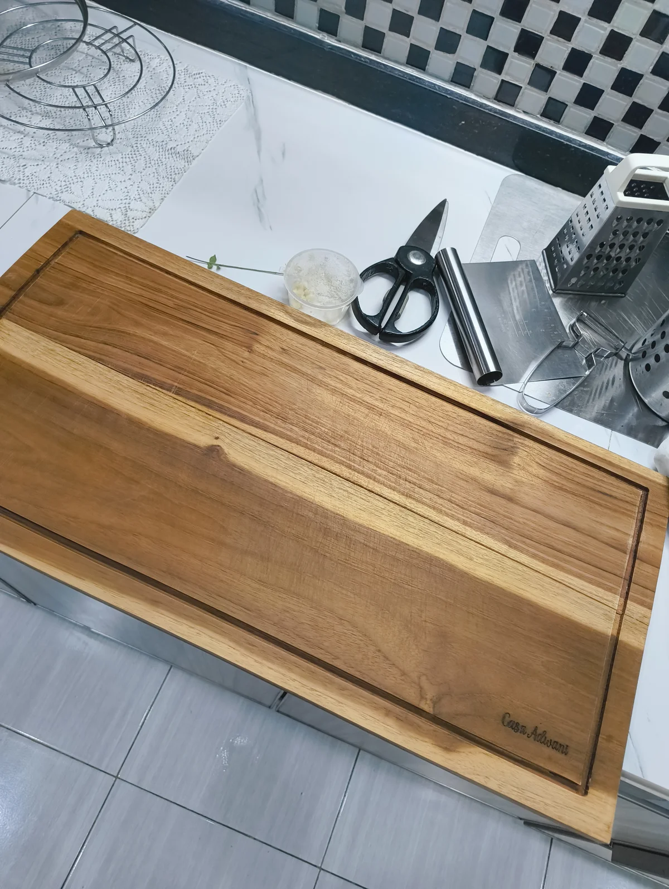

Once I had my curated collection of knives, the next natural step was the surface you cut with the knife on. I once bought stainless steel chopping boards, and learned how big of a mistake that was quite quickly. I have a very nice end-grain butchers block that isn't pictured, and that's because it's still sealed in its box. I'm keeping it for when I move into my own place and finally get my dream kitchen. For context: I live at home, and as much as I love my family, they can't take care of nice kitchen equipment, so keeping my chopping board away from them is the safest move for now.

For the meantime, I have a teak cutting board that does the job, along with a few of these Ike[a rubber mats](https://www.ikea.co.id/en/products/kitchen-tools/chopping-boards/finfordela-art-20556913?srsltid=AfmBOoplzY2nGfNYBM_PijCkAxQM3ULRhC4UCkGdRHd6ofqDEiUPG8OW) that work great for cutting raw meats and chicken. I don't like how you have to bend them into place all the time, but they do the job for now.

Stainless steel bowls and sheet pans are the biggest game changer to my prep game that I've added in the past year or so. I used to always just leave the stuff I prepped on the board and then get annoyed when I run out of space. I'd always see people using trays and bowls for prep and wonder "why tf would you do that, it's just more shit to wash". I guess with age comes wisdom, because I totally see why now. Also I use a bench scraper for scraping stuff off the boards and into the bowls or pan. 10/10 would recommend. I also have a peeler and a box grater, and those are pretty much the only tools I ever use. Maybe a salad spinner once in a while.  

## Cooking

Ahh, now we move on to the fun stuff. I really didn't know how much food changes once you use the right pan. It's like you unlock some sort of level that you didn't know existed before. Like many home cooks, I always just used whatever non-stick skillet I had, which was probably so old and filled me with more toxins than the cigarettes I smoked in high school (sorry mom).

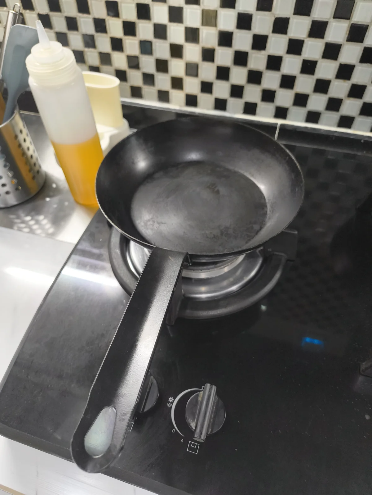

My first foray into the world of real pans was a cheap 22cm Carbon Steel Skillet (unbranded off tokopedia) and I still love that thing. I don't use it much these days because it got rusted when I neglected it and went on a few trips, so I need to nuke and reseason it, but it was my first and will always hold a special place in my heart.

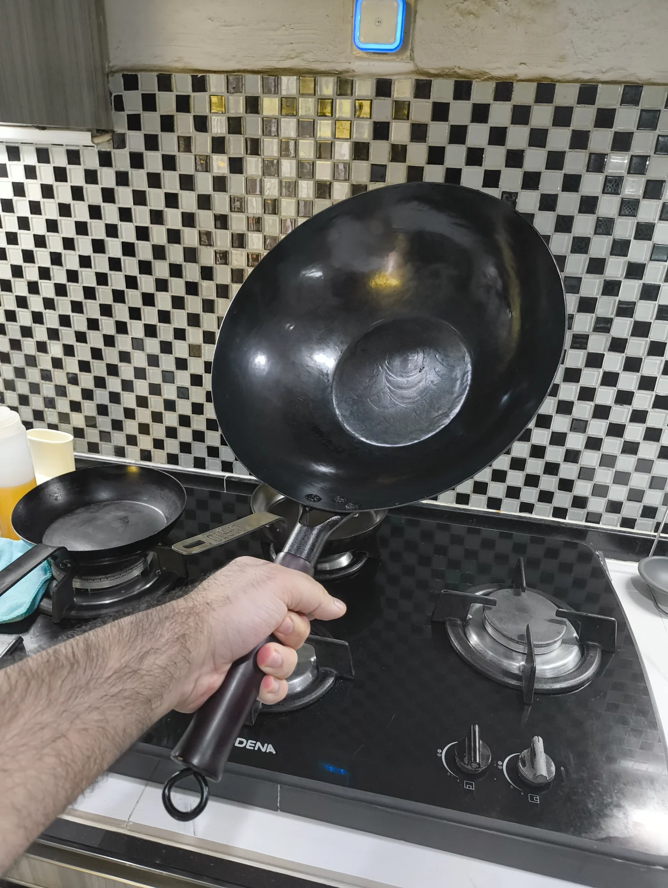

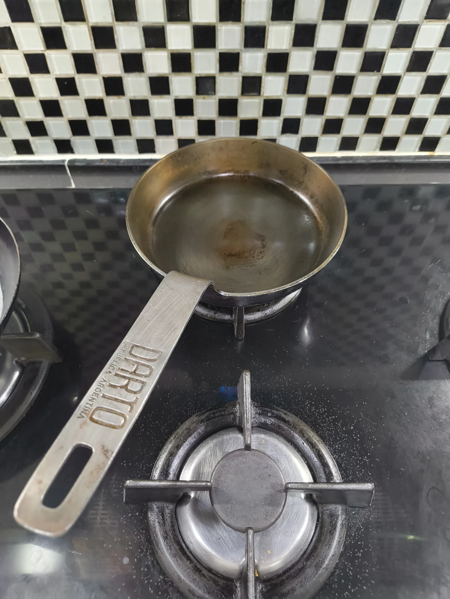

My next big boy purchase was my Carbon Steel Wok, which is also unbranded but came pre-seasoned and has never let me down. Once I got comfortable with these two carbon steel pans, I bought a "nicer" carbon steel pan from Darto. Unfortunately however, me being the cheap guy that I am, went for the 20cm which is just a bit too small for any of the cooking I do. I feel like if I was smarter and bought the 25cm, I would use it a lot more.

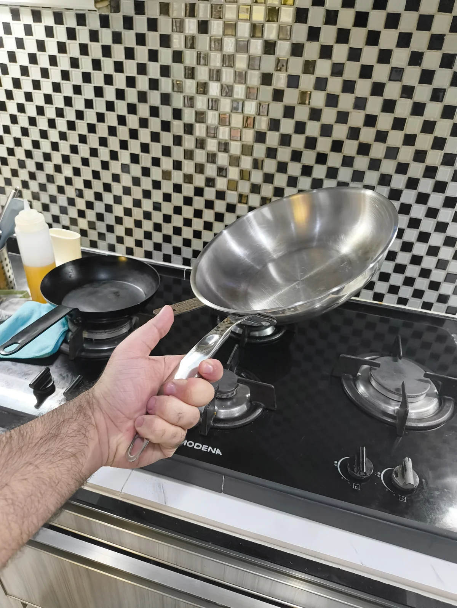

Now, while I love my Carbon Steels, if I had to pick just one pan to use for the rest of my life, this would be the one. the 26cm semi-wok from Restopan. The most perfect and versatile pan I have used in my life. This thing was cheap, it takes a beating, needs little to no maintenance and always just performs like a champ. You know I'm not worried about this thing by the fact that I let anyone in the house use it. Anyone.

Oh yeah I also have [this non-stick](https://www.monotaro.id/items/s030472426.html?utm_source=google&utm_medium=pla&utm_campaign=22608577675&utm_content=180145020197&utm_term=others_cat_group_2_pricebrand_group_1&gad_source=1&gad_campaignid=22608577675&gclid=Cj0KCQjw5JXFBhCrARIsAL1ckPtKSXCOcd_XpMbFx97vESHHhYS-Jn4jwBnv-0o9ASOdL4NCmuuquVkaAhcOEALw_wcB) that I only really use for french omlettes. It's the best non-stick I've ever used, but it's super hard to find. I don't think they make it anymore. I probably should've bought like 10 when I could. Oh well.

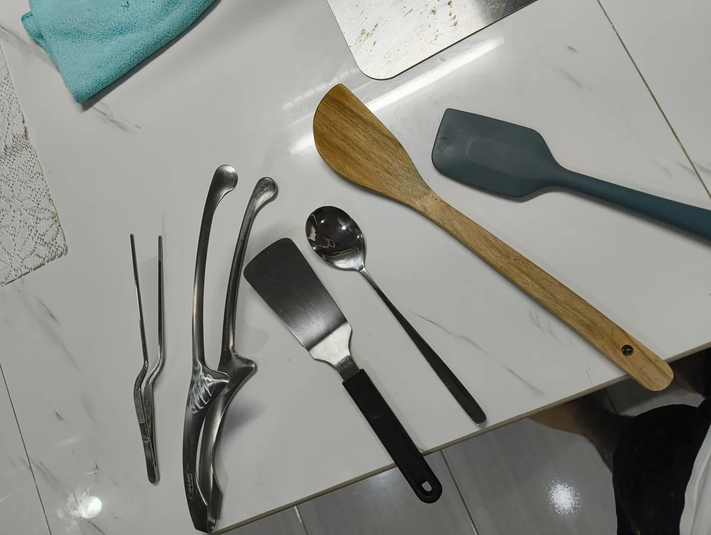

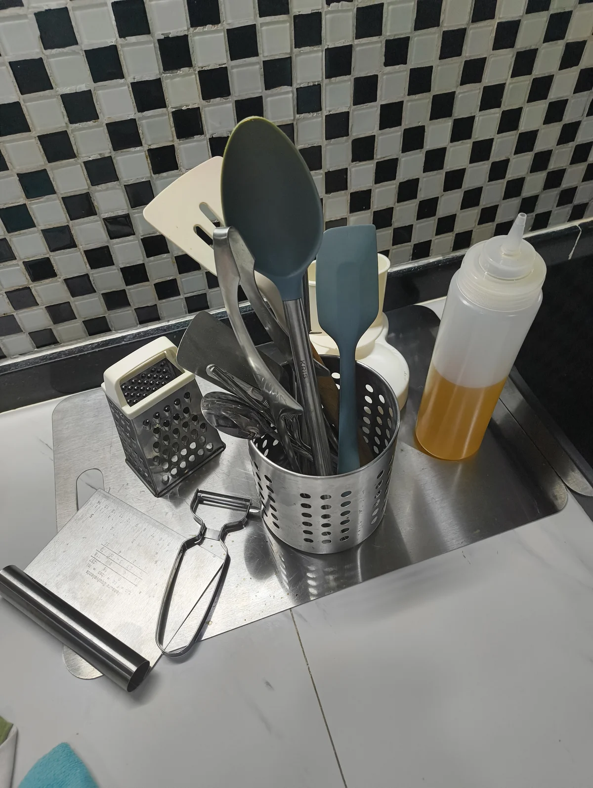

Other than frying pans, everything else I need lives next to the stove. A silicon spatula, some yakiniku tongs, smaller dainty cutesy tongs and an offset spatula. Throw in a korean soup spoon and a transparent squeeze bottle for oil and you're done.

I think when it comes to prep and cooking, I don't consider any other tools as must have. I'm not counting appliances btw that's a whole different ball game.

## Maintenance

Maintenance is probably the most neglected part of any home cook's kitchen. However, just like website maintenance, I like to think of kitchen maintenance as insurance for peace of mind. You're doing a little bit of work up front, to save yourself from a bigger headache down the line. Personally to me, maintenance can be split into two key focus points - **ingredients** and **tools**.

### Ingredient Maintenance

These are small steps you can take to making your prep time so much more relaxing and convenient, especially when you share a kitchen. There's really only two things I do here;

1.  Label all my leftovers and ingredients
2.  Write down what's in the fridge and what needs to be used

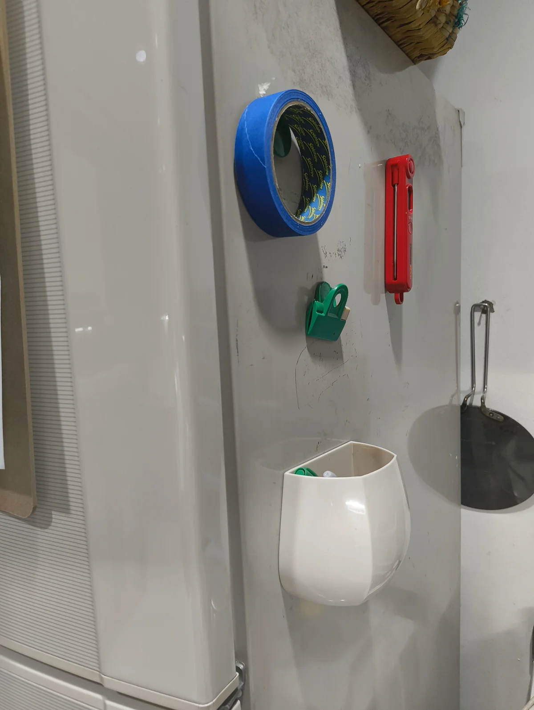

I saw a [youtube video once](https://www.youtube.com/watch?v=WMgcI_I-EG4) where this guy spoke about how he only uses deli containers to store everything, because it keeps it looking consistent and clean, and them being see through makes it super easy to spot whats what. That was a game changer for me. I keep masking tape and a container of sharpies attached to my fridge so that I always remember to label whatever goes into these containers.

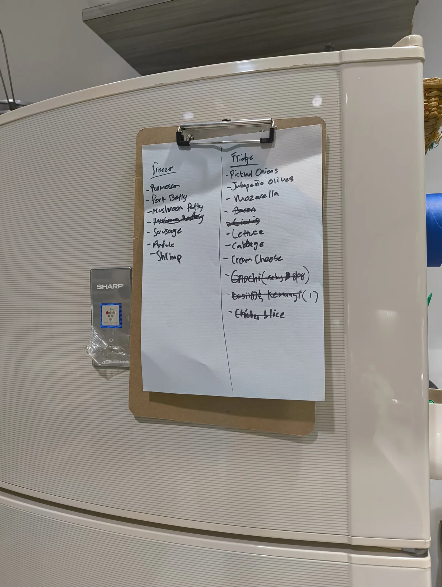

On the front of the fridge I have a clipboard that I stuck magnetic tape on to, and all leftovers and ingredients go onto this list. When they're used, they get scratched out. Simple enough, but saves you from having stuff in the fridge go bad.

### Tool Maintenance

Tool maintenance probably isn't as easy as ingredient maintenance, and the benefits are more long term and subtle rather than immediately noticeable. but it does make a difference.

Carbon steel pans need seasoning, so that's a given and I won't go into that. Leaving that aside, key maintenance comes down to knives and chopping boards. Boards are the easier one - every few months, I pour a little bit of food-grade mineral oil and wipe the board down and leave it to dry. The oil makes sure the wood stays hydrated and prevents smells and cracks, and keeps a decent seal to stop the wood from absorbing cooking juices.

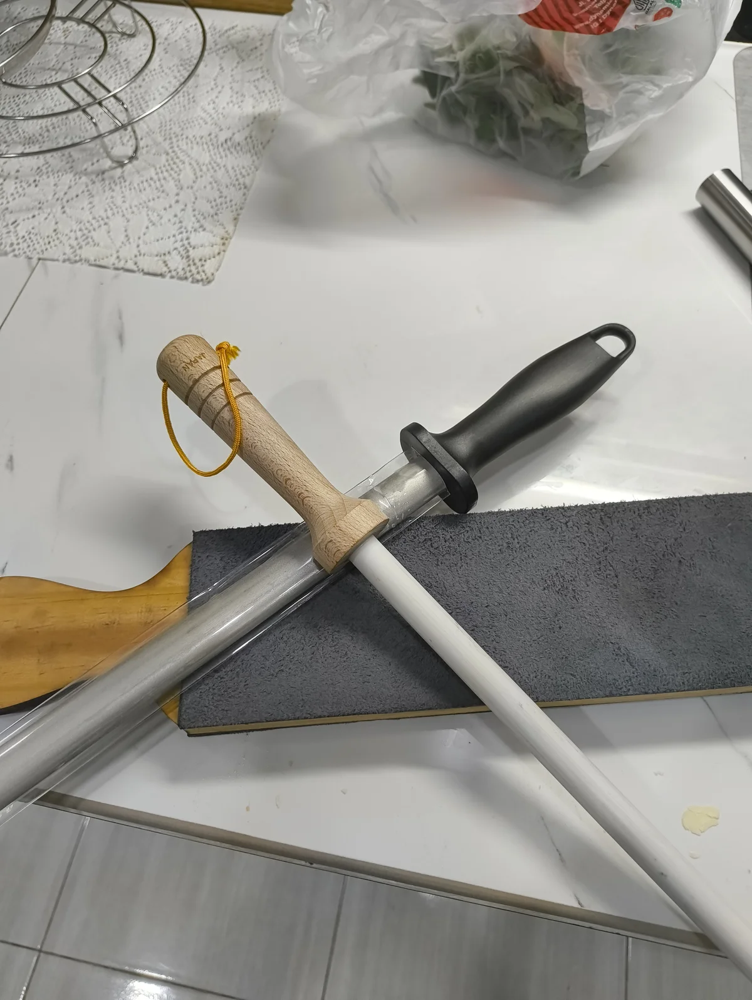

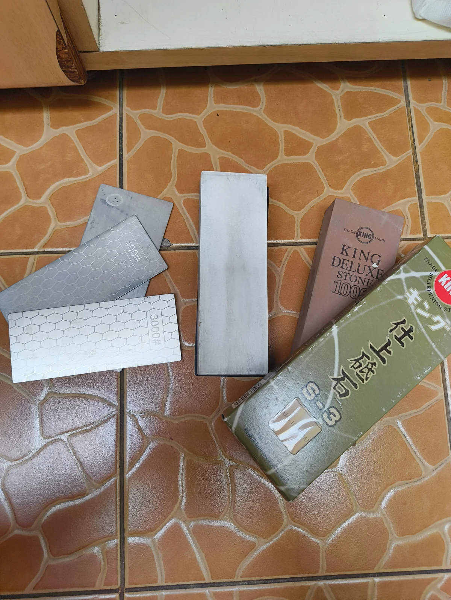

Knives go through two stages of maintenance.

1.  Every few weeks, I use the ceramic honing rod and hone the knives. Basically, everytime you use a knife, you're pushing the edge around a bit. Overtime this may make you think you have a dull knife when really the edge is just misaligned. Honing it brings the edge back into position.
2.  Eventually, your knife does get dull, and that's when it needs a sharpening. I've tried every method of sharpening that exists, from pull through sharpeners and diamond plates to whetstones. I've settled on a diamond sharpening rod for quick touch ups and cheaper knives, while nicer knives go through the whetstone process. The diamond stones are handy for levelling out the whetstone after every use. So far I've only used a cheap two-sided chinese whetstone, I'll switch to my japanese ones when I'm more confident in my technique. After each sharpening session, the leather strop you see there is used to just remove any finer leftover steel.

When I sat down to write this post, I wasn't expecting to go into such heavy detail. However, isn't that always the case with anything I write? Anyway, I guess the above post summarises my thoughts around kitchen equipment as well as gives you a glimpse into the kinds of tools I use as a home cook. I wonder how much this is going to change overtime.
