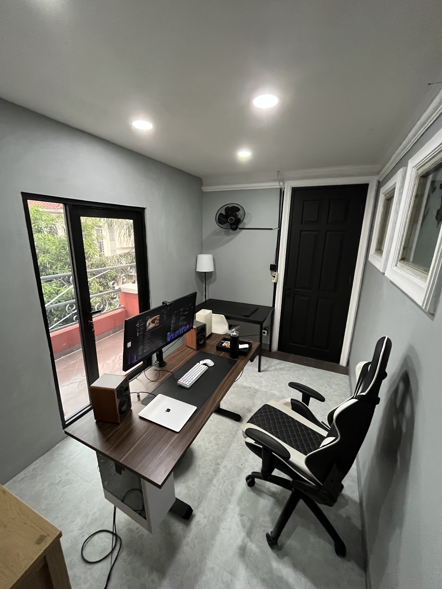
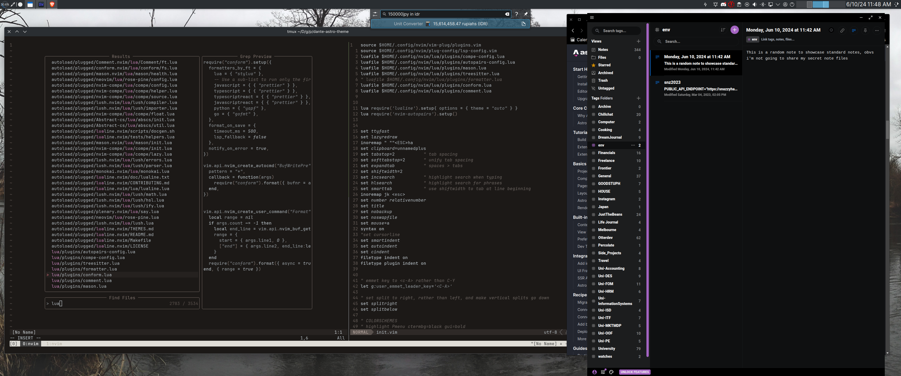
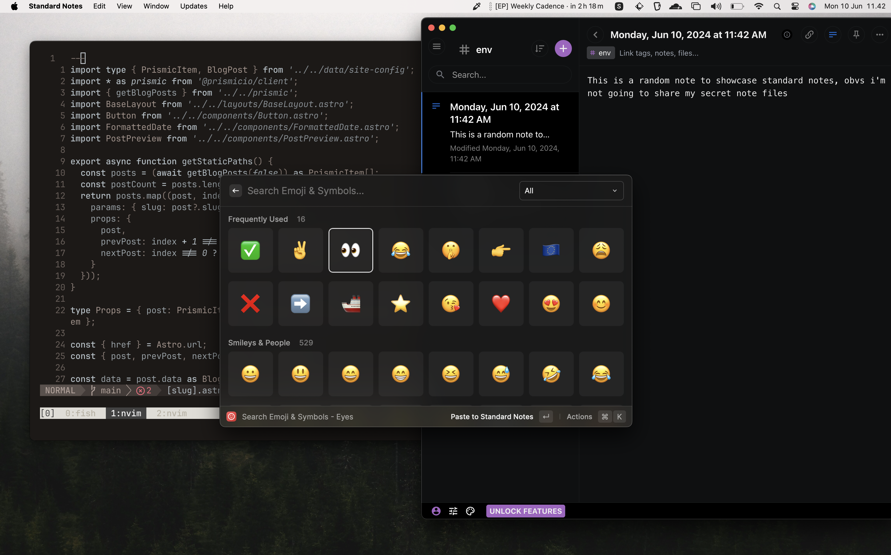

By far the most read post on my blog has been the post about [the tools I use day to day as a Software Developer](https://snazzyham.com/writing/the-tools-i-use/). However, a lot has changed since then, and rather than updating the post - which I've done once already - I figured it made more sense to write a whole new post about it.

Let's start with what has changed since that post was updated;

-   I left my job at [GOODSTUPH](https://goodstuph.org), and worked as VP of Product at [Chillchat](https://chillchat.com), where my day to day responsibilities did not really involve any code
-   Returned the Thinkpad and 4k Monitor to GS, bought a PC for my main machine and a Macbook Air for travels and couch working
-   Bought 2 27inch monitors (1440p and 1080p), used them for 3 months, sold them and bought a single 34inch 1440p ultrawide with USB-C charging
-   Left Chillchat, joined [Otterdev](https://otterdev.io) to help improve workflow and processes, took over as co-Managing Partner when our CTO Chris left, and now I serve as COO and Interim CTO
-   Built an actual dedicated office space in what used to be my balcony at home. Who knew building a wall was so easy, no idea why it took Trump so long

Now that I'm in more of an operations and managerial role, I don't code nearly as much as I did (or would like to). I mostly jump in for code reviews here and there, or help the team when something requires my attention. Therefore, if you feel like the new list is super different to the one before, well, you know why.

## Hardware

-   Main PC is a custom build that I did back in 2022. It runs a Ryzen 5600g, 32 GB ram and I threw in 3 SSDs in there. It runs KDE, but we'll go into that in the software section.
-   For travels, I use the Macbook Air M1 in it's base configuration. It works fine nine times out of ten, aside from the one time I need to run like 8 docker containers, which is rare.
-   My monitor of choice is the AOC U34P2C. I never used to be a fan of Ultrawide displays, and honestly given the choice I'd probably go with a really nice 3:2 4k monitor. However, monitors in Indonesia seem to be way more expensive than they are in the US or other parts of the world. Additionally, you don't really get many 3:2's here, when I was looking there was just one Huawei that was double the price of the AOC. Also, having USB-C on the AOC is great cause everything is plugged into the monitor, so when I plug in the Mac it charges and has access to all the peripherals, and when I switch back to the PC the peripherals move over.
-   I use a Mouse from Press Play, it isn't great but it charges over USB-C which is nice.
-   I have two keyboards on my desk. A Kodoo Gecko with replaced PBT Keycaps and Akko Purple switches, and a stock Noir Neo Melo keyboard. Why two? Well, I love the Kodoo, but it's really loud and I'm on calls a lot. Also, my wrists started to hurt at one point so I chose to switch to an ultra low profile to help with ergonomics.
-   My headphones of choice are the Soundcore Life Q35's. The mic on them sucks, but for that I just use the webcam on the Logitech C270 or something like that, seems to work fine. I also have wired dBe Acoustics DJ80's plugged in, because it gets annoying to keep switching off and on bluetooth headphones. On the go I use Airpods Pro's.
-   I used to have Edifier R1280dbs speakers in the office as well (also use the same ones in my bedroom), but that was way too overkill for my tiny office and I never really took advantage of them, so I moved that to the living room and bought some edifier USB PC speakers. Those sucked so hard I got rid of them within a day and decided to just stick with headphones only.

That pretty much sums up the hardware. It's pretty minimal really, aside from the two keyboards that is.

## Software

Ahh software, the category that has changed the most. While I used to mostly live in the terminal, now I mostly live in the browser. I still won't move to VS Code tho, neovim is far superior. All of the tools I use are pretty much cross platform in one way or the other, so my linux and mac setup look pretty much the same.

My browser of choice is [**Brave**](https://brave.com/). The sync is beautiful, being able to push tabs from one device to another works much better than it ever did in Chrome. I did use **[Arc](https://arc.net/)** for like two weeks when it came out, and while it's cool, I still prefer Brave. At Otterdev, we use **Discord** for comms, **Linear** for task management (which I love) and **Notion** for our notes sharing and other housekeeping tasks.

On the personal productivity side, I use **Standard Notes** for all my personal note keeping, **Notion Calendar** for keeping track of events and setting up timeblocks for clients and as much as my team asks me to move to **FigJam** for my random diagrams and architecture stuff _(because we pay for it anyway)_, my muscle memory still defaults to **[Excalidraw](https://excalidraw.com/).**

For the rare times that I do hop into some code, **[WezTerm](https://wezfurlong.org/wezterm/)** is my new terminal of choice. It's super fast and smooth, configurable via lua, and is cross platform. The rest of my code/terminal tools are pretty much just a [trimmed down version](https://github.com/snazzyham/dotfiles) from the old list;

-   Neovim as my do-it-all text editor, now with builtin LSP instead of coc-nvim
-   Tmux
-   ripgrep _(explained in the previous post)_
-   fish-shell, with starship as a prompt

That's really it.

### Linux Specific

I think the only Linux specific tools I use are really what I need to make my desktop environment usable. I run **Garuda Linux** because it's an easy way to get Arch running that isn't Manjaro, and I wanted something that came with the **zen** kernel. I run KDE Plasma, which used to be themed out the wazoo, but since Plasma 6 I just use the default Breeze theme because it looks good enough. I have some Kwin plugins to help manage multiple windows on an ultrawide, and to give me other nice functionality like a clipboard manager and color picker. That's about it really. Funny now that I think about it; I went from _**customising everything**_ to going mostly stock.

### Mac Specific

As for Mac specific stuff, there is only one app that I run on macOS that isn't available on Linux, and thats **Raycast.** Oh, I also use Shottr for annotating screenshots but that's quite rare. Raycast has replaced all of my other mac specific tools, cause it does everything I need. These are the only features I really use

-   The app launcher, as a replacement for alfred
-   Currency and time conversions
-   Window management
-   emoji picker
-   color picker
-   Clipboard manager

It's crazy that i used to need separate tools for all of those and now I only need one.

### Honorable Mentions

I guess something that I hadn't spoken much about before was infrastructure tooling and frameworks. For the longest time, I was a huge fan of Vercel's products. I had been using their hosting service since it was called "Now" and they were called ZEIT. However, after seeing what's been happening with their new pricing and how it's been affecting some of our clients, I'm starting to get a little put off by them.

The [new version of SST](https://ion.sst.dev) looks promising, although I'd probably wait till it's stable before giving that a hard look. [Coolify](https://coolify.io/) looks "cool" lol, but I haven't been able to play around with it much yet. Other than that, we mostly use DigitalOcean and Vercel.

In terms of frameworks, [Astro](https://astro.build) has been amazing to work with and I think they're really on to something special. We primarily use Astro for landing pages at Otterdev, unless we think Webflow makes more sense for the client. I'll talk more about that and my disdain for Elementor in the future.

On the app side, we still go with [Next.js](https://nextjs.org) in most cases, even though we considered using [SvelteKit](https://kit.svelte.dev/) initially. Now however, I'm starting to think that we'll go with [Solid](https://www.solidjs.com/) and SolidStart instead for our future projects. As always, it depends on the requirements at the time.
