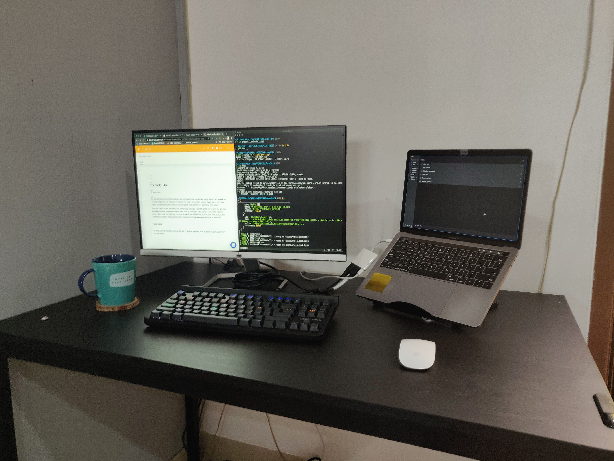
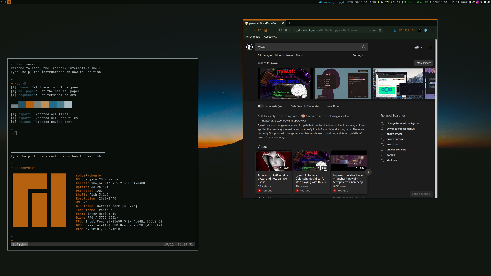
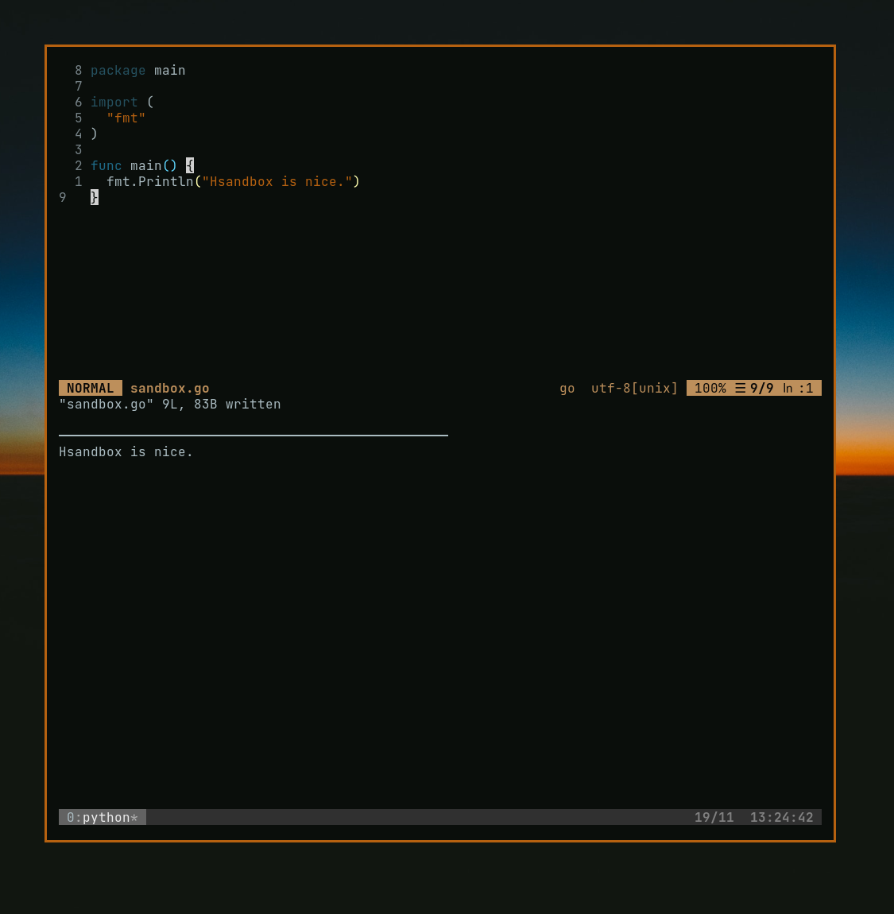
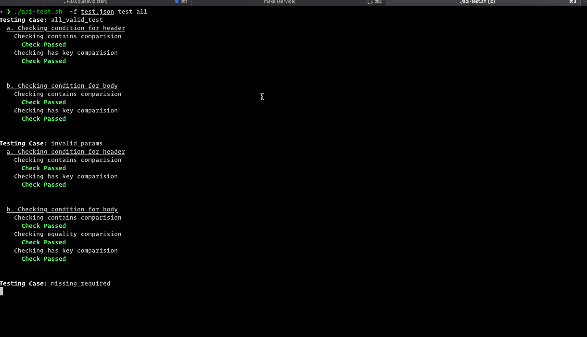
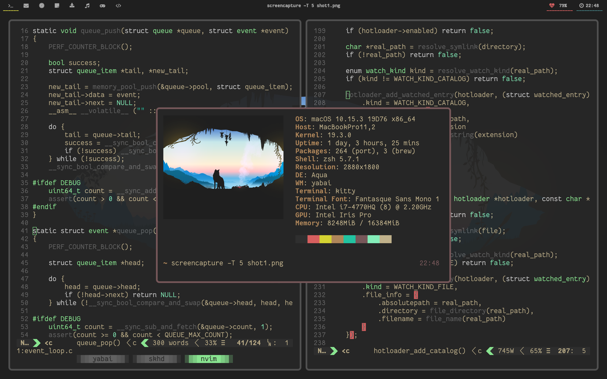
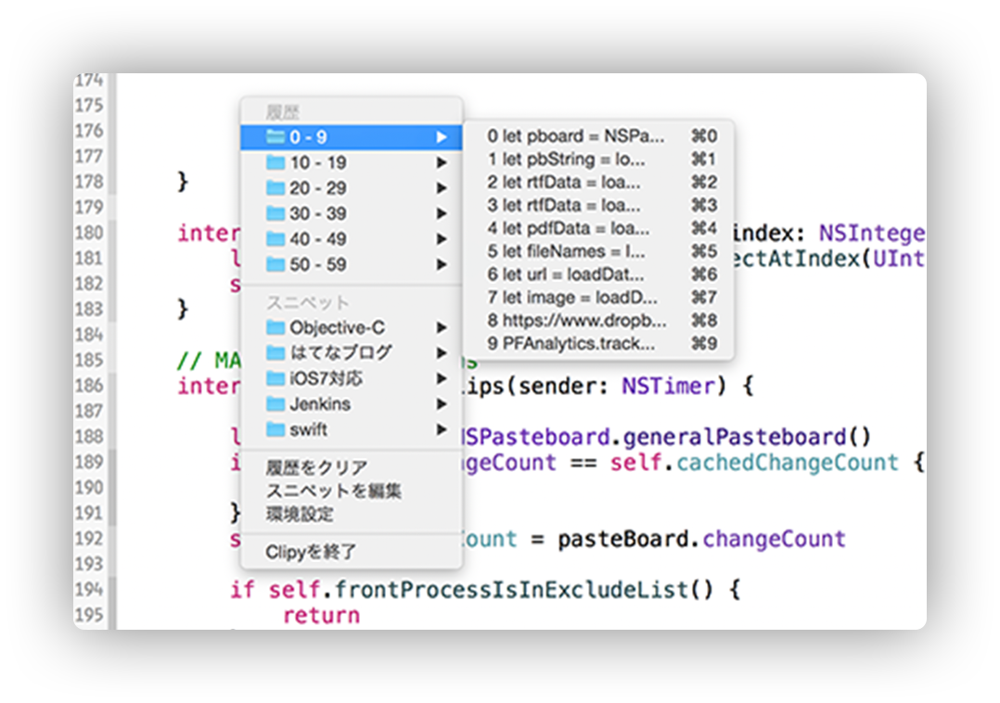

I've been a huge fan of workflows for a long time now. Specifically, workflow and tooling. When I look back at how my setup has evolved over the years, I've noticed that there is a correlation between the number of tools I use, and my increased productivity. However, that being said, there definitely is a diminishing point of return.

There was a point in time, back when I first started programming at University, that I used no tools. As I got more excited about tooling, I ended up using _too many_ tools. By refining my setup over the years, I think I've come across a good sweet spot right now. That's not to say this is a definitive list, as my setup is constantly changing and evolving. However, I'll be updating this list whenever anything changes that I feel is worth mentioning.

### Updated, November 2020

Okay, so I wasn't expecting this much to change over the past 8 months, but a lot has. Since writing the post below, we haven't gone back to working at the office. Yes, covid has lasted a lot longer than any of us really expected it to. Like OKC during this years draft, I made a lot of moves and changes before settling where I am now. Notably;

-   Brought my 4k monitor home from work
-   Moved my desk into my room and ran a dual monitor setup
-   Sold the 1080p HP monitor that I had just bought
-   Bought a new desk chair because I was getting a back ache from the old ikea chair I had
-   Bought an old Thinkpad x250 to experiment with Linux
-   Fell in love with Linux again and took the plunge, swapped in my work-issued Macbook for a Thinkpad X1 Carbon
-   Put up my x250 for sale, after using it probably 4 times, given I don't need it anymore (I still have it though)
-   Moved my desk back outside

So yeah, a _**lot has changed.**_ For one, I always liked Linux, but was always scared that I wouldn't be able to use it as my main OS. I am happy to report that its been almost 3 months and things have exceeded my expectations. I keep a Windows boot around but I've only ever used it to work on Instagram Filters, which you can't do on Linux just yet.

### Hardware

\[_I'll add a photo when I have the time to make things look pretty\]_

-   Lenovo Thinkpad X1 Carbon 7th Gen, 16GB RAM, 512GB NVMe SSD, 1080p matte display _(yes, a step down from the Mac, but completely fine for me)_
-   Same old keyboard, with some new PBT keycaps
-   Cheap wireless mouse from Joyseus, way more ergonomic than my Magic Mouse
-   HP Envy 27 4k monitor
-   Belkin Thunderbolt 3 HD Dock (or some ridiculous name like that)

_**Note:**_ The dock doesn't really support this laptop. It supposedly can charge devices up to 85w, and while the Lenovo only requires 65w, the Belkin was designed to only work with a Mac. So while I can get display output up to 4k60, it doesn't really charge my laptop. If I'm using it, it stays on the same battery level throughout. If I leave it to charge overnight, I'm at about 96% when I start work in the morning. It's not great but it'll do for now.

### Hardware _(outdated)_

I'm starting off with hardware because I feel like it's the least important of all. Whatever you use that works for you, stick with it.

My main machine is a **2017 Macbook Pro with Touchbar (13 inch, 4 Thunderbolt Ports).** It's great, but probably too much for my needs. Aside from the rare times that I work on an AR Filter for Instagram and need the processing power, I probably don't need a machine this overkill. If I had to get a new laptop now, I'd probably get the 2020 Macbook Air or a Surface Laptop 3. I went from being a _huge fan_ of Windows to absolutely despising it. Now I'm willing to give it a shot again, however, a lot of my work involves building websites that I need to test on Safari (iOS and Desktop), and it's much nicer to do that on a Mac.

Because the keyboard on my macbook is _so so bad_, I use an external keyboard. Below I've broken down both my home and work setup.

#### Home

-   HP 24f 1080p Monitor - cheap and gets the job done, especially since I only work at home during weekends and when the world is going through a pandemic
-   DA Gaming Mechanical Keyboard with Brown Switches - also cheap and also gets the job done. It's a little tacky but for under Rp. 300k, it's one of the best keyboards you can get imo.
-   Apple Magic Mouse - I only have 1 USB port on the Apple Dongle, so I needed a bluetooth mouse and this works fine.

#### Work

_I'll update this post with a photo of my setup when this whole Coronavirus thing ends and I can go back to work._

-   HP Envy 27 4K - Honestly one of the best monitors I've used. I would love to experiment with an UltraWide, but for now this is sufficient. One gripe I have with it however, is that it burns in quite easily on apps with lighter backgrounds.
-   Cheap HP Gaming Mouse - I don't use a mouse that often, and this has side buttons which I like.
-   Logitech G213 Prodigy - A great keyboard, probably better than any mechanical I use. I just wish it didn't have a number pad. This thing is CHONKY.
-   Belkin Thunderbolt 3 Express HD - Honestly one of the best pieces of hardware in my roster. Everything plugs into this, from my monitor to an ethernet cable, and all I have to do is plug one cable into my computer. It works great and I've never had issues with it.

### Software _(Linux)_

Let's start with everyone's biggest dilemma when it comes to switching to Linux. Which Distro to pick? I settled on Manjaro. It combined the benefits of Arch with the simplicity of Ubuntu. If I had to do this all over, I'd probably go with ArchLabs, but I'm super happy with it still.

#### i3+gaps, pywal, kitty

Similar to why I used _Yabai_ on my Mac, I use i3. It's a super lightweight tiling window manager, meaning I can open up windows and have them tile automatically, and manipulate windows and spaces all from my keyboard. Sometimes I use the mouse, but I'm trying to get out of that habit. i3 also has a plugin called i3 Blocks, that lets you set up the status bar up top with bash scripts, which is super useful for me. On my Mac I used to use [Vanilla](https://matthewpalmer.net/vanilla/) to hide icons, but mostly because they were useless. With this, I can easily see how much RAM I'm using, which Docker processes are running and so on.

**Pywal** is one of the best tools I have ever used. Coupled together with some custom bash scripts and pywalfox, I can set my desktop colors, terminal colors, vim colorscheme and even theme firefox to a single color pallete, that's generated from my wallpaper. For someone like me who likes to change themes almost weekly, there's nothing better. I use kitty as my terminal now over alacritty, but that's because the latter didn't support pywal all too well.

#### Hsandbox

[Hsandbox](http://labix.org/hsandbox) is one of those tools that I can't imagine being without now that I've found it. It's basically a local REPL. On Mac I used to use Scratches, but that was just for JS, and since I've found myself doing a lot more Go lately, I was relying on REPL.it, a web tool. Not the best experience because it would take time to load, and I would be in a foreign text editing experience. With Hsandbox, it runs locally so its super quick, and it even loads my \`.vimrc\`. which is just so, so nice.

#### api-test

If you're a reader of this blog, you'd know how much I love glorified bash scripts. [api-test by subeshb1](https://github.com/subeshb1/api-test) is probably my favourite of those right now. It allows you to write out your different API requests in a JSON file, and gives you a nice utility to test using curl. It's replaced Insomnia for me, and I find myself using it daily. I love it and I don't know what more I can say about it. Most people would probably still prefer using something like Insomnia or Postman, however since my workflow is mostly command line based, this slides in just perfectly.

Other than that, my tooling involves the same, if not Linux alternatives of the tools mentioned below.

### Software _(Macintosh)_

This is where it gets interesting. Now, I use a lot of software. However, I don't use it all that often. For that reason, I'm going to keep this list as minimal as possible, with only the tools I feel are crucial to my workflow. If I included a list of all the tools I use, it would get kind of redundant. There are some apps I use _only when I need to_, like Spark AR Studio, and so I don't feel like it deserves a spot on this list. I'm also going to leave off the basics like Chrome and iTerm, because I feel like those are just based on preference, and you will get similar results no matter what terminal or browser you choose to use.

I'll be referencing my dotfiles quite a bit in the coming paragraphs. [You can find them here](https://github.com/snazzyham/dotfiles).

#### Yabai

[Yabai](https://github.com/Clipy/Clipy), previously chunkwm, has to be one of the biggest contributions to my productivity and overall developer satisfaction as of late. I used to use apps like Magnet and Spectacle to tile my windows, but it was such a drag to have to manually tile everytime I opened a window.

With yabai, windows I open are automatically tiled based on a ratio I've pre-defined. I then have hotkeys to move between my windows, move windows to other spaces, toggle window modes and more. It's a little heavy to get into so I wouldn't recommend it for everyone. However, if you're interested, do check it out. My config file for yabai, along with skhd (which sends keypresses to yabai), can be found in my dotfiles.

#### Clipy

A clipboard manager is one of those things you don't think you need till you use one, and then you feel like you could never live without it. I use [Clipy](https://https://github.com/Clipy/Clipy) just because it's the first one I tried and I was happy with it. You can use whatever works well for you. If you haven't tried using one, please do. I use it for the most basic simple things. I often find myself copying multiple things and then looking for the thing I copied. This just saves me so much time now.

#### Vim

The way I use [vim](https://www.vim.org/) in itself deserves to be a whole article on its own, but I'll keep this brief. I used to use Notepad++, Sublime and then Atom. I always got annoyed with the bloat and distractions. Yes, it's cool to have a nice editor with all these plugins and fancy themes and things. However, after a point, I was wasting too much time. I'd try to find a new theme every week, try out a bunch of new plugins, play around with the app more than I worked. This is definitely more of a me issue. At one point, my Atom install was 3gigs. I made the switch to Vim as I was looking for a leaner, simpler setup that would be easy for me to get going when I switched machines.

My config is _fairly_ minimal, with necessary plugins such as vim-surround and vim-multi-cursor. I tried switching to VS Code recently but I just couldn't do it. I love vim and I'm so accustomed to it.

This, along with [Tmux](https://www.hamvocke.com/blog/a-quick-and-easy-guide-to-tmux/), is the perfect dev setup for me. The best part is its truly cross platform, and I can have the same setup no matter which OS I choose to use.

#### Ripgrep

I bet this is one of those tools you weren't expecting to see here. However, the more I use [Ripgrep](https://github.com/BurntSushi/ripgrep), the more it proves itself as an invaluable asset in my arsenal. I could technically get away with using the regular grep, but I like the added features that ripgrep provides, such as automatically ignoring files in your .gitignore and syntax highlighting.

What ripgrep does is basically allows you to search for text within files, directly from the terminal. This is handy when you're working with a codebase that has a ton of files, and you're trying to look for a variable declaration or something else that you wrote somewhere. It has saved me a ton of time.

#### Rsync

[Rsync](https://linux.die.net/man/1/rsync) allows you to upload local files to a remote directory and vice-versa. It is yet another command line utility that you've either never heard of, or probably only seen used in StackOverflow tutorials. Some backstory, working at an Agency, I work with a lot of servers. Each of our clients have multiple websites hosted on multiple servers. I used to use FileZilla for this and it worked great. Rsync however, takes that to the next level.

The way I use it, I just put an rsync command in my \`package.json\` or \`deploy.sh\` script, and everytime I need to push a new feature, I just run \`npm run deploy\` or \`./deploy.sh\` and it takes care of that for me.

#### Honorable Mentions

-   [Insomnia](https://insomnia.rest/) and [httpie](https://httpie.org/) for API testing _(now api-test)_
-   [Microsoft To-Do](https://todo.microsoft.com/tasks/) for my todo list _(back to Google Tasks, because of the better Android Widget)_
-   [Bear](https://bear.app/) for project notes _(Moved over to Notion, because it's free now. Also, a notebook.)_
-   [Draw.io](https://app.diagrams.net/) and [DrawSQL](https://drawsql.app/) for UML and Database Diagrams
-   [Next.js](https://nextjs.org/) and [Parcel](https://parceljs.org/) because they're just so damn nice
-   [Kap](https://getkap.co/) for screen recording _(Peek, on Linux)_
-   [Alfred](https://www.alfredapp.com/) which I use as a glorified app switcher and launcher _(Rofi, on Linux)_
