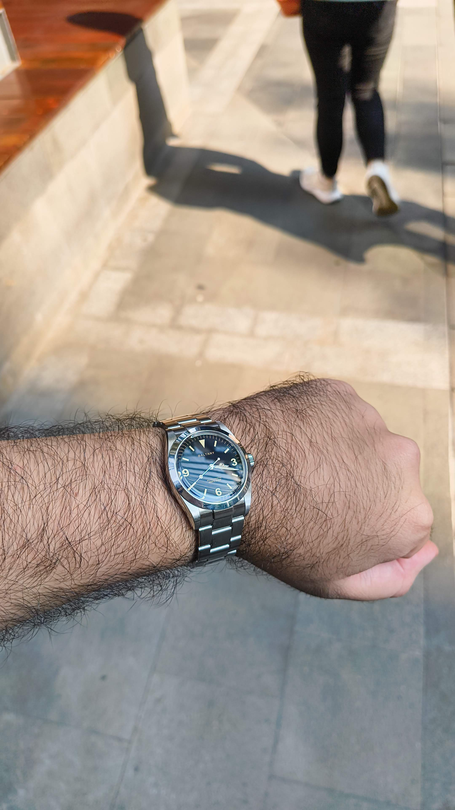

If you've read some of my previous posts, you know that tools play an important part of my life. From kitchen tools to software development tools, anything you want to achieve in life requires the right set of tooling. Those of you who know me personally (even though barely any of those people even know I have a blog), probably know my stance on material items and my disdain of brands, or flex culture in general. Not that anyone would ever admit they like to flex.

This makes my passion for watches an interesting point of contention within myself. On the one hand, I see watches for what they are. Precision-made tools that serve a particular purpose, crafted with meticulous detail and steeped in tradition that goes back centuries. On the other hand, I can't ignore what most people see watches as today - a status symbol, an item that, for those in the know, signals to others how much money you make and where you sit on the proverbial social ladder without you having to explicitly announce it.

You could say the watch industry is one of many that embody the yin and yang, from the finance bros of the world who see a Submariner as a rite of passage, to the Navy SEALs who see the same watch as a badge earned in an entirely different way.

Somewhere between those extremes is me — a guy who loves watches, but can’t quite make peace with what they mean. Watch collecting screws with me.

I love the machines for what they are - stories told in gears and springs, proof that a thing built right can outlast the people who wear it. I’ll sit there watching Wristwatch Revival, hypnotised by a half-century-old Rolex ticking back to life. That’s beautiful. That’s craft.

But Rolex today? Half tool, half flex. The kind of thing finance guys flash over oysters and champagne, pretending it’s about tradition. Meanwhile, a beat-up Seiko, serviced right, will run just as long at a fraction of the price. That’s the truth nobody likes to admit.

I think back to people in history I've admired. Bourdain hated that kind of flexing. Hated the puffed-up bullshit. And yeah, the man wore a Rolex. Maybe that’s the real fight in me: wanting to love the story, but not wanting to drop twenty grand on something that could shatter the second I smack it against the wall chasing my cat, or when I grab a carbon steel skillet straight out of the oven like an idiot. Because let’s be honest, a twenty-grand Rolex doesn’t make you James Bond. It just makes it hurt more when you fuck it up.

Over time, I've come to look at watch collecting through the lens of earmarking moments in time. It's not really something I tell people about, but more like personal mementos for key moments in life. In fact, recently I was at one of those junctures. I had a big thing happen, and I wanted a watch to signify the moment. It was one of those moments where I was seriously considering whether it was time for my first Rolex. I was at a watch event, I had a 36mm neo-vintage explorer on my wrist. The ideal watch in my opinion. That battle I alluded to earlier however still raged within me. Was I even ready for it? Would I regret it when the movement choked up and I had to drop $800 on a service? What if I accidentally washed my hands with it and it gave way? Was that actually my fear, or was I just not ready to take that step. I guess we'll never know. What I do know however, is I walked out with a Baltany homage of the 1016 explorer, and I love this thing to bits. No frills, just a plain, simple 36mm watch with a workhorse movement.

Maybe it’s not about the watch at all. Maybe it’s just about living with the contradiction of wanting the story but hating the flex. I don’t have an answer. For now, the Baltany on my wrist tells the story of where I am now, where I'm going remains to be seen.

